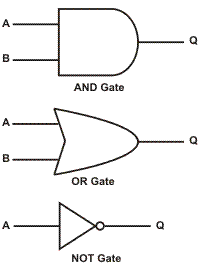

<!-- section start -->
<!-- attr: { class:'slide-title', showInPresentation: true, hasScriptWrapper: true } -->
# Primitive Data Types and Variables
## Integer, Floating-point, Text Data, Characters, Variables, Literals
<!--  -->
<div class="signature">
	<p class="signature-course">C# Fundamentals</p>
	<p class="signature-initiative">Telerik Software Academy</p>
	<a href="http://telerikacademy.com" class="signature-link">http://telerikacademy.com</a>
</div>


<!-- section start -->

<!-- attr: { showInPresentation: true, hasScriptWrapper: true, style:'font-size: 0.8em' } -->
# Table of Contents
- [Primitive Data Types](#/primitive)
  - [Integer](#/integer)
  - [Floating-Point / Decimal Floating-Point](#/float)
  - [Boolean](#/bool)
  - [Character](#/char)
  - [String](#/string)
  - [Object](#/object)
- [Declaring and Using Variables](#/declaring)
  - [Identifiers](#/identifiers)
  - [Declaring Variables and Assigning Values](#/assign)
  - [Literals](#/literals)
- [Nullable Types](#/nullable)
- [Dynamic Types](#/dynamic)

<!--  -->


<!-- section start -->
<!-- attr: { id:'primitive', class:'slide-section', showInPresentation: true, hasScriptWrapper: true } -->
<!-- # <a id="primitive"></a>Primitive Data Types -->
<!--  -->
<!--  -->


<!-- attr: { showInPresentation: true, hasScriptWrapper: true } -->
# How Computing Works?

- Computers are machines that process data
  - Data is stored in the computer memory in **variables**
  - Variables have **name**, **data type** and **value**
- _Example_ of variable definition and assignment in C#

```cs
int count = 5;
```

<ul>
  <li class="fragment balloon" style="top:61.75%; left:0%">Data type</li>
  <li class="fragment balloon" style="top:52%; left:10%;">Variable name</li>
  <li class="fragment balloon" style="top:61.75%; left:24%;">Variable value</li>
</ul>

<!-- attr: { showInPresentation: true, hasScriptWrapper: true } -->
# What Is a Data Type?
- A **data type**:
  - Is a domain of values of similar characteristics
  - Defines the type of information stored in the computer memory (in a variable)
- _Examples_:
  - Positive integers: `1`, `2`, `3`, `…`
  - Alphabetical characters: `a`, `b`, `c`, `…`
  - Days of week: `Monday`, `Tuesday`, `…`

<!--  -->


<!-- attr: { showInPresentation: true, hasScriptWrapper: true } -->
# Data Type Characteristics
- A **data type** has:
  - **Name** (C# keyword or .NET type)
  - **Size** (how much memory is used)
  - **Default value**
- _Example_:
  - Integer numbers in C#
  - Name: `int`
  - Size: 32 bits (4 bytes)
  - Default value: `0`

<!--  -->


<!-- section start -->
<!-- attr: { id:'integer', class:'slide-section', showInPresentation: true, hasScriptWrapper: true } -->
# <a id="integer"></a>Integer Types
<!--  -->


<!-- attr: { showInPresentation: true, hasScriptWrapper: true } -->
<!-- # Integer Types -->

- **Integer types**:
  - Represent **integer numbers**
  - May be **signed** or **unsigned**
  - Have range of values, depending on the size of memory used
- The default value of integer types is:
  - `0` – for integer types
    - except `0L` – for the `long` type

<!--  -->


<!-- attr: { showInPresentation: true, style: 'font-size: 0.8em' } -->
<!-- # Integer Types -->
- `sbyte` (signed 8-bit)
  - Min: `-128`
  - Max: `127`
- `byte` (unsigned 8-bit)
  - Min: `0`
  - Max: `255`
- `short` (signed 16-bit)
  - Min: `-32,768`
  - Max: `32,767`
- `ushort` (unsigned 16-bit)
  - Min: `0`
  - Max: `65,535`
<!-- attr: { showInPresentation: true, style: 'font-size: 0.8em' } -->
<!-- # Integer Types (cont.) -->
- `int` (signed 32-bit)
  - Min: `-2,147,483,648`
  - Max: `2,147,483,647`
- `uint` (unsigned 32-bit)
  - Min:`0`
  - Max: `4,294,967,295`
- `long` (signed 64-bit)
  - Min: `-9,223,372,036,854,775,808`
  - Max: `9,223,372,036,854,775,807`
- `ulong` (unsigned 64-bit)
  - Min: `0`
  - Max: `18,446,744,073,709,551,615`

<!--  -->


<!-- attr: { showInPresentation: true } -->
<!-- # Integer Types: _Example_ -->
- Depending on the unit of measure we may use different data types:

- _Example: Measuring times_

```cs
byte centuries = 20;    // Usually a small number
ushort years = 2000;
uint days = 730480;
ulong hours = 17531520; // May be a very big number
Console.WriteLine("{0} centuries is {1} years," +
                  " or {2} days, or {3} hours.",
                  centuries, years, days, hours);
```


<!-- attr: { class:'slide-section demo', showInPresentation: true, hasScriptWrapper: true } -->
<!-- # Integer Types -->
## [Demo]()


<!-- section start -->
<!-- attr: { id:'float', class:'slide-section', showInPresentation: true, hasScriptWrapper: true } -->
# <a id="float"></a>Floating-point and Decimal Floating-Point Types

<div style="text-align:center;height: 25%">
<!--  -->
</div>

<!-- attr: { showInPresentation: true, hasScriptWrapper: true } -->
# Floating-point Types
- **Floating-point** types:
  - Represent **real numbers**
  - May be **signed** or **unsigned**
  - Have range of values and different **precision** depending on the size of memory used
  - Can behave abnormally in the calculations

<div style="text-align: center; height: 40%">
<!--  -->
</div>
<!-- attr: { showInPresentation: true, hasScriptWrapper:true, style:"font-size: 0.9em" } -->
<!-- # Floating-Point Types -->
- Floating-point types are:
  - `float` (32-bits)
    - Min: `±1.5 × 10`<code><sup>-45</sup></code>
    - Max:  `±3.4 × 10`<code><sup>38</sup></code>
    - Precision: **7 digits**
  - `double` (64-bits)
    - Min: `±5.0 × 10`<code><sup>-324</sup></code>
    - Max: `±1.7 × 10`<code><sup>308</sup></code>
    - Precision: **15-16 digits**
- The default value of floating-point types:
  - Is `0.0F` for the `float` type
  - Is `0.0D` for the `double` type

<!-- attr: { showInPresentation: true, hasScriptWrapper: true, style:"font-size: 0.95em" } -->
# PI Precision – _Example_

- See below the difference in precision when using `float` and `double`:
- _Note_: The `f` suffix in the first statement!
  - Real numbers are by default interpreted as `double`!
  - One should **explicitly** convert them to `float`

```cs
float floatPI = 3.141592653589793238f;
double doublePI = 3.141592653589793238;
Console.WriteLine("Float PI is: {0}", floatPI);
Console.WriteLine("Double PI is: {0}", doublePI);
```

<!--  -->


<!-- attr: { showInPresentation: true, hasScriptWrapper: true } -->
# Abnormalities in the Floating-Point Calculations
- Sometimes abnormalities can be observed when using floating-point numbers
  - Comparing floating-point numbers can not be performed directly with the `==` operator
- _Example_:

```cs
double a = 1.0f;
double b = 0.33f;
double sum = 1.33f;
bool equal = (a+b == sum); // False!!!
Console.WriteLine("a+b={0}  sum={1}  equal={2}",
                  a+b, sum, equal);
```

<!-- attr: { showInPresentation: true, hasScriptWrapper: true } -->
# Decimal Floating-Point Types
- There is a special decimal floating-point real number type in C#:
  - `decimal` (128-bits)
    - Min: `±1,0 × 10`<code><sup>-28</sup></code>
    - Max: `±7,9 × 10`<code><sup>28</sup></code>
    -Precision: **28-29 digits**
  - Used for financial calculations
  - No round-off errors
  - Almost no loss of precision
- The default value of `decimal` type is:
  - `0.0M` (`M` is the suffix for decimal numbers)


<!-- attr: { class:'slide-section demo', showInPresentation: true, hasScriptWrapper: true } -->
<!-- # Floating-Point and Decimal Floating-Point Types -->
## [Demo](https://github.com/TelerikAcademy/CSharp-Part-1/tree/master/Topics/02.%20Data-Types-and-Variables/demos/FloatingPointTypes)


<!-- section start -->
<!-- attr: { id:'bool', class:'slide-section', showInPresentation: true, hasScriptWrapper: true } -->
<!-- # <a id="bool"></a>Boolean Type -->
<!--  -->
<!--  -->


<!-- attr: { hasScriptWrapper: true, style:'font-size: 0.9em' } -->
# The Boolean Data Type
- The **Boolean data type**:
  - Is declared by the `bool` keyword
  - Has two possible values: `true` and `false`
  - Is useful in logical expressions
- The default value is `false`
- _Example:_ boolean variables with values `true` and `false`:

```cs
int a = 1;
int b = 2;
bool greaterAB = (a > b);
Console.WriteLine(greaterAB);  // False
bool equalA1 = (a == 1);
Console.WriteLine(equalA1);    // True
```

<!-- attr: { class:'slide-section demo', showInPresentation: true, hasScriptWrapper: true } -->
<!-- # Boolean Type -->
## [Demo]()
<div style="text-align: center">
<!--  -->
</div>


<!-- section start -->
<!-- attr: { id:'char', class:'slide-section', showInPresentation: true, hasScriptWrapper: true } -->
<!-- # <a id="char"></a>Character Type -->
<div style="text-align">
<!--  -->
</div>
<!--  -->

<!-- attr: { showInPresentation: true, hasScriptWrapper: true } -->
# The Character Data Type
- The **character data type**:
  - Represents symbolic information
  - Is declared by the `char` keyword
  - Gives each symbol a corresponding integer code
  - Has a `'\0'` default value
  - Takes 16 bits of memory (from `U+0000` to `U+FFFF`)

<!--  -->


<!-- attr: { hasScriptWrapper: true, showInPresentation: true, style: 'font-size: 0.95em' } -->
# Characters and Codes
- _Example_: Symbols have unique Unicode codes:

```cs
char symbol = 'a';
Console.WriteLine("The code of '{0}' is: {1}",
    symbol, (int) symbol);

symbol = 'b';
Console.WriteLine("The code of '{0}' is: {1}",
    symbol, (int) symbol);

symbol = 'A';
Console.WriteLine("The code of '{0}' is: {1}",
    symbol, (int) symbol);


symbol = '0';
Console.WriteLine("The code of '{0}' is: {1}",
    symbol, (int) symbol);
```

<ul>
  <li class="fragment balloon" style="top: 35%; left: 51%">`'a'` has code value `97`</li>
  <li class="fragment balloon" style="top: 53%; left: 51%">`'b'` has code value `98`</li>
  <li class="fragment balloon" style="top: 70%; left: 51%">`'A'` has code value `65`</li>
  <li class="fragment balloon" style="top: 87%; left: 51%">`'0'` has code value `48`</li>
</ul>

<!-- attr: { class:'slide-section demo', showInPresentation: true, hasScriptWrapper: true } -->
<!-- # Character Type -->
## [Demo]()
<!--  -->

<!-- section start -->
<!-- attr: { id:'string', class:'slide-section', showInPresentation: true, hasScriptWrapper: true } -->
<!-- # <a id="string"></a>String Type -->
<!--  -->


<!-- attr: { showInPresentation: true } -->
# The String Data Type
- The **string data type**:
  - Represents a sequence of characters
  - Is declared by the `string` keyword
  - Has a default value `null` (no value)
- Strings are enclosed in quotes:

```cs
string s = "Microsoft .NET Framework";
```

- Strings can be concatenated
  - Using the `+` operator


<!-- attr: { showInPresentation: true } -->
<!-- # String Concatenation: _Example_ -->
- _Example:_ Concatenating the two names of a person to obtain his full name:
  - _Note_: a space is missing between the two names! We have to add it manually

```cs
string firstName = "Ivan";
string lastName = "Ivanov";
Console.WriteLine("Hello, {0}!\n", firstName);

string fullName = firstName + " " + lastName;
Console.WriteLine("Your full name is {0}.",
  fullName);
```


<!-- attr: { class:'slide-section demo', showInPresentation: true, hasScriptWrapper: true } -->
<!-- # String Type -->
## [Demo]()
<!--  -->


<!-- section start -->
<!-- attr: { id:'object', class:'slide-section', showInPresentation: true, hasScriptWrapper: true } -->
<!-- # <a id="object"></a>Object Type -->
<!--  -->


<!-- attr: { showInPresentation: true, hasScriptWrapper: true } -->
# The Object Type
- The object type:
  - Is declared by the `object` keyword
  - Is the base type of all other types
  - Can hold values of **any type**

<div style="text-align: center">
<!--  -->
<!--  -->
</div>

<!-- attr: { showInPresentation: true, hasScriptWrapper: true } -->
<!-- # Using Objects -->
- _Example_ of an object variable taking different types of data:

```cs
object dataContainer = 5;
Console.Write("The value of dataContainer is: ");
Console.WriteLine(dataContainer);

dataContainer = "Five";
Console.Write("The value of dataContainer is: ");
Console.WriteLine(dataContainer);
```

<!--  -->


<!-- attr: { class:'slide-section demo', showInPresentation: true, hasScriptWrapper: true } -->
<!-- # The Object type -->
## [Demo]()
<!--  -->


<!-- section start -->
<!-- attr: { class:'slide-section', showInPresentation: true, hasScriptWrapper: true } -->
<!-- # Introducing Variables -->
<!--  -->


<!-- attr: { showInPresentation: true, hasScriptWrapper: true } -->
# What Is a Variable?
- A variable is a:
  - **Placeholder** of information that can usually be changed at run-time
- Variables allow you to:
  - **Store** information
  - **Retrieve** the stored information
  - **Manipulate** the stored information

<!-- attr: { showInPresentation: true, hasScriptWrapper: true } -->
# Variable Characteristics
- A variable has:
  - Name
  - Type (of stored data)
  - Value
- _Example_:
  - Name: `counter`
  - Type: `int`
  - Value: `5`

```cs
int counter = 5;
```

<!-- section start -->
<!-- attr: { id:'declaring', class:'slide-section', showInPresentation: true, hasScriptWrapper: true } -->
<!-- # <a id="declaring"></a>Declaring and<br/>Using Variables -->
<!--  -->


<!-- attr: { hasScriptWrapper: true, showInPresentation: true } -->
# Declaring Variables
- When declaring a variable we:
  - Specify **its type**
  - Specify **its name** (called identifier)
  - May give it an initial value
- The syntax is the following:

```cs
<data_type> <identifier> [= <initialization>];
```

- _Example:_

```cs
int height = 200;
```

<!-- attr: { id:'identifiers', showInPresentation: true, hasScriptWrapper: true } -->
# <a id="identifiers"></a>Identifiers

- Identifiers may consist of:
  - Letters (Unicode)
  - Digits `[0-9]`
  - Underscore `_`
- Identifiers
  - Must begin with either a letter or an underscore
  - Cannot be a C# keyword

<!--  -->


<!-- attr: { showInPresentation: true } -->
<!-- # Identifiers -->
- Identifiers
  - Should have a descriptive name
  - It is recommended to use only Latin letters
  - Should be neither too long nor too short
- _Note_:
  - In C# small letters are considered different than the capital letters (case sensitivity)


<!-- attr: { showInPresentation: true, style: 'font-size: 0.9em' } -->
<!-- # Identifiers – _Examples_ -->
- _Examples_ of correct identifiers:

```cs
int New = 2; // Here N is capital
int _2Pac; // This identifiers begins with _
string поздрав = "Hello"; // Unicode symbols used

// The following is more appropriate:
string greeting = "Hello";
int n = 100; // Undescriptive
int numberOfClients = 100; // Descriptive

// Overdescriptive identifier:
int numberOfPrivateClientOfTheFirm = 100;
```

- _Examples_ of incorrect identifiers:

```cs
int new;  // new is a keyword
int 2Pac; // Cannot begin with a digit
```


<!-- section start -->

<!-- attr: { id:'assign', class:'slide-section', showInPresentation: true, hasScriptWrapper: true } -->
<!-- # <a id="assign"></a>Assigning Values To Variables -->


<!-- attr: { showInPresentation: true, hasScriptWrapper: true, style: 'font-size: 0.9em' } -->
# Assigning Values
- Assigning of values to variables
  - Is achieved by the `=` operator
- The `=` operator has
  - Variable identifier on the left
  - Value of the corresponding data type on the right
  - Could be used in a cascade calling, where assigning is done from right to left

```cs
int firstValue = 3;
int secondValue;

secondValue = firstValue;

firstValue = secondValue = 3; // Avoid this!
```


<!-- attr: { showInPresentation: true, hasScriptWrapper: true, style: 'font-size: 0.8em' } -->
# Initializing Variables

- Initializing
  - Is assigning of initial value
  - Must be done before the variable is used!
  - By using the `new` keyword

    ```cs
    int num = new int(); // num = 0
    ```
  - By using a literal expression

    ```cs
    float heightInMeters = 1.74f;
    ```
  - By referring to an already initialized variable

    ```cs
    string greeting = "Hello World!";
    string message = greeting;
    ```

<!-- attr: { class:'slide-section demo', showInPresentation: true, hasScriptWrapper: true } -->
<!-- # Assigning and Initializing Variables -->
## [Demo]()
<!--  -->
<!--  -->


<!-- section start -->
<!-- attr: { id:'literals', class:'slide-section', showInPresentation: true, hasScriptWrapper: true } -->
# <a id="literals"></a>Literals
<!--  -->


<!-- attr: { showInPresentation: true, hasScriptWrapper: true } -->
# What are Literals?
- Literals are:
  - Representations of values in the source code
- There are six types of literals
  - Boolean
  - Integer
  - Real
  - Character
  - String
  - The `null` literal

<!--  -->


<!-- attr: { showInPresentation: true, hasScriptWrapper: true } -->
# Boolean and Integer Literals
- The boolean literals are:
  - `true`
  - `false`
- The integer literals:
  - Are used for variables of type `int`, `uint`, `long`, and `ulong`
  - Consist of digits
  - May have a sign (`+`, `-`)
  - May be in a hexadecimal format

<!--  -->


<!-- attr: { showInPresentation: true, hasScriptWrapper: true, style: 'font-size: 0.9em' } -->
# Integer Literals
- _Examples_ of integer literals
  - The `'0x'` and `'0X'` prefixes mean a hexadecimal value

    ```cs
    0xA8F1
    ```

  - The `'u'` and `'U'` suffixes mean a `ulong` or `uint` type
    ```cs
      12345678U
    ```

  - The `'l'` and `'L'` suffixes mean a `long` or `ulong` type

      ```cs
      9876543L
      ```

<!-- attr: { showInPresentation: true } -->
<!-- # Integer Literals – _Example_ -->
- _Note_: the letter `'l'` is easily confused with the digit `1` so it’s better to use `'L'`!!!

```cs
// The following variables are
// initialized with the same value:
int numberInHex = -0x10;
int numberInDec = -16;

// The following causes an error,
//because 234u is of type uint
int unsignedInt = 234u;

// The following causes an error,
//because 234L is of type long
int longInt = 234L;
```


<!-- attr: { showInPresentation: true } -->
# Real Literals
- The real literals:
  - Are used for values of type `float`, `double` and `decimal`
  - May consist of digits, a sign and `.`
  - May be in exponential notation: `6.02e+23`
- The `f` and `F` suffixes mean `float`
- The `d` and `D` suffixes mean `double`
- The `m` and `M` suffixes mean `decimal`
- The default interpretation is `double`


<!-- attr: { showInPresentation: true } -->
<!-- # Real Literals – _Example_ -->
- _Example_ of incorrect `float` literal:

```cs
// The following causes an error
// because 12.5 is double by default
float realNumber = 12.5;
```

- A correct way to assign floating-point value (using also the exponential format):

```cs
// The following is the correct
// way of assigning the value:
float realNumber = 12.5f;
// This is the same value in exponential format:
realNumber = 1.25e+7f;
```


<!-- attr: { showInPresentation: true, hasScriptWrapper: true } -->
# Character Literals
- The character literals:
  - Are used for values of the `char` type
  - Consist of two single quotes surrounding the character value: `'<value>'`
- The value may be:
  - Symbol
  - The code of the symbol
  - Escaping sequence


<!-- attr: { showInPresentation: true } -->
# Escaping Sequences
- Escaping sequences are:
  - Means of presenting a symbol that is usually interpreted otherwise (like `'`)
  - Means of presenting system symbols (like the new line symbol)
- Common escaping sequences are:
  - `\'` for single quote `\"` for double quote
  - `\\` for backslash `\n` for new line
  - `\uXXXX` for denoting any other Unicode symbol


<!-- attr: { showInPresentation: true } -->
<!-- # Character Literals – _Example_ -->
- _Examples_ of different character literals:

```cs
char symbol = 'a'; // An ordinary symbol
symbol = '\u006F'; // Unicode symbol code in a			      // hexadecimal format (letter 'o')
symbol = '\u8449'; // 葉 (Leaf in Traditional Chinese)
symbol = '\''; // Assigning the single quote symbol
symbol = '\\'; // Assigning the backslash symbol
symbol = '\n'; // Assigning new line symbol
symbol = '\t'; // Assigning TAB symbol
symbol = "a"; // Incorrect: use single quotes
```


<!-- attr: { hasScriptWrapper: true, showInPresentation: true } -->
# String Literals
- String literals:
  - Are used for values of the string type
  - Consist of two double quotes surrounding the value: `"<value>"`
  - May have a `@` prefix which ignores the used escaping sequences: `@"<value>"`
- The value is a sequence of character literals

```cs
string s = "I am a sting literal";
```


<!-- attr: { showInPresentation: true } -->
<!-- # String Literals – _Example_ -->
- Benefits of quoted strings (the `@` prefix):
- In quoted strings `\"` is used instead of `""`!

```cs
// Here is a string literal using escape sequences
string quotation = "\"Hello, Jude\", he said.";
string path = "C:\\WINNT\\Darts\\Darts.exe";

// Here is an example of the usage of @
quotation = @"""Hello, Jimmy!"", she answered.";
path = @"C:\WINNT\Darts\Darts.exe";

string str = @"some
		text";
```


<!-- attr: { class:'slide-section demo', showInPresentation: true, hasScriptWrapper: true } -->
<!-- # String Literals -->
## [Demo]()

<!-- section start -->
<!-- attr: { id:'nullable', class:'slide-section', showInPresentation: true, hasScriptWrapper: true } -->
# <a id="nullable"></a>Nullable Types
<!--  -->
<!--  -->
<!--  -->


<!-- attr: { showInPresentation: true } -->
<!-- # Nullable Types -->
- **Nullable** types are instances of the `System.Nullable` struct
  - Wrapper over the **primitive types**
  - E.g. `int?`, `double?`, etc.
- **Nullabe** type can represent the normal range of values for its underlying value type, plus an additional `null` value
- Useful when dealing with **Databases** or other structures that have default value `null`

<!-- attr: { showInPresentation: true, style:'font-size:0.9em' } -->
<!-- # Nullable Types – _Example_ -->
- _Example_ with **Integer**:

```cs
int? someInteger = null;
Console.WriteLine(
  "This is the integer with Null value -> "
	+ someInteger);
someInteger = 5;
Console.WriteLine(
  "This is the integer with value 5 -> "
	+  someInteger);
```

```cs
double? someDouble = null;
Console.WriteLine(
  "This is the real number with Null value -> "
  + someDouble);
someDouble = 2.5;
Console.WriteLine(
  "This is the real number with value 5 -> "
	+ someDouble);
```


<!-- attr: { class:'slide-section demo', showInPresentation: true, hasScriptWrapper: true } -->
<!-- # Nullable Types -->
## [Demo]()
<!--  -->
<!--  -->


<!-- section start -->
<!-- attr: { id:'dynamic', class:'slide-section', showInPresentation: true, hasScriptWrapper: true } -->
# <a id="dynamic"></a>Dynamic Types in _C#_
## Types Holding Anything & Evaluated at Runtime


<!-- attr: { showInPresentation: true } -->
<!-- # Dynamic Types -->
- **Dynamic types** in C# (keyword `dynamic`)
  - Can hold anything (string, number, object, function / method reference)
  - Operations evaluated at runtime
  - Behave like types in JavaScript / PHP

```cs
dynamic a = 5;
dynamic b = 3;
Console.WriteLine(a + b); // 8 (sum of integers)
a = "5";
b = 3;
Console.WriteLine(a + b); // 53 (string concatenation)
```


<!-- attr: { class:'slide-section demo', showInPresentation: true, hasScriptWrapper: true } -->
<!-- # Dynamic Types -->
## [Demo]()

<!-- section start  -->

<!-- attr: { class:'slide-section', showInPresentation: true, hasScriptWrapper: true } -->
<!-- # Primitive Data Types and Variables
## Questions? -->
<!--  -->
<!--  -->


<!-- attr: { showInPresentation: true, hasScriptWrapper: true } -->
# Free Trainings @ Telerik Academy
- Fundamentals of C# ProgrammingTrack of Courses
    - [csharpfundamentals.telerik.com](csharpfundamentals.telerik.com)
  - Telerik Software Academy
    - [telerikacademy.com](https://telerikacademy.com)
  - Telerik Academy @ Facebook
    - [facebook.com/TelerikAcademy](facebook.com/TelerikAcademy)
  - Telerik Academy Learning System
    - [telerikacademy.com](https://telerikacademy.com)

<!--  -->
<!--  -->
<!--  -->
