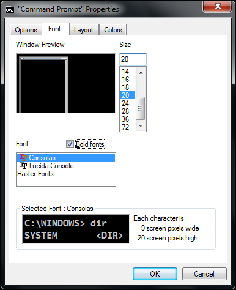

<!-- section start -->
<!-- attr: { class:'slide-title', showInPresentation:true, hasScriptWrapper:true, style:'font-size: 42px' } -->
# Console Input / Output
## Reading and Writing to the Console

<div class="signature">
    <p class="signature-course">C# Fundamentals</p>
    <p class="signature-initiative">Telerik Software Academy</p>
    <a href="https://telerikacademy.com" class="signature-link">https://telerikacademy.com</a>
</div>

<!--  -->
<!--  -->


<!-- section start -->
<!-- attr: { showInPresentation:true, hasScriptWrapper:true, style:'font-size: 42px' } -->
# Table of Contents
- [Printing to the Console](#/printing)
  - [Printing Strings and Numbers](#/printingtypes)
- [Reading from the Console](#/reading)
  - [Reading Characters](#/chars)
  - [Reading Strings](#/strings)
  - [Reading Numeral Types](#/numeral)
  - [Parsing Strings to Numeral Types](#/parsing)
- [Various _Examples_](#/examples)

<!--  -->


<!-- section start -->
<!-- attr: { class:'slide-section', showInPresentation:true, hasScriptWrapper:true, style:'font-size: 42px' } -->
<!-- # Printing to the Console -->
<!--  -->


<!-- attr: { id:'printing', showInPresentation:true, hasScriptWrapper:true, style:'font-size: 42px' } -->
# <a id="printing"></a>Printing to the Console
- The **Console** is used to display information in a text window
- **Can display different values**:
  - Strings
  - Numeric types
  - All primitive data types
- To print to the console use the class **Console** (Found in namespace **System**)

<!--  -->


<!-- attr: { showInPresentation:true, hasScriptWrapper:false, style:'font-size: 42px' } -->
# The Console Class
- Provides methods for console **input** and **output**
  - **Input**
    - `Read(…)` – reads a single character
    - `ReadKey(…)` – reads a combination of keys
    - `ReadLine(…)` – reads a single line of characters
  - **Output**
    - `Write(…)` – prints the specified argument on the console
    - `WriteLine(…)` – prints specified data to the console and moves to the next line


<!-- attr: { id:'printingtypes', showInPresentation:true, hasScriptWrapper:false, style:'font-size: 42px' } -->
# <a id="printingtypes"></a>Console.Write
- Printing an integer variable

```cs
int a = 15;

Console.Write(a); // 15
```

- Printing more than one variable using a formatting string

```cs
double a = 15.5;
int b = 14;

Console.Write("{0} + {1} = {2}", a, b, a + b);
// 15.5 + 14 = 29.5
```

- Next print operation will start from the same line


<!-- attr: { showInPresentation:true, hasScriptWrapper:false, style:'font-size: 42px' } -->
# Console.WriteLine
- Printing a string variable

```cs
string str = "Hello C#!";

Console.WriteLine(str);
```

- Printing more than one variable using a formatting string

```cs
string name = "Marry";
int year = 1987;

Console.WriteLine("{0} was born in {1}.", name, year);
// Marry was born in 1987.
```

- Next printing will start from the new line


<!-- attr: { showInPresentation:true, hasScriptWrapper:false, style:'font-size: 42px' } -->
# Printing to the Console – _Example_

```cs
static void Main()
{
    string name = "Peter";
    int age = 18;
    string town = "Sofia";

    Console.Write("{0} is {1} years old from {2}.",
                  name, age, town);
    // Result: Peter is 18 years old from Sofia.

    Console.Write("This is on the same line!");

    Console.WriteLine("Next sentence will be" +
                      " on a new line.");

    Console.WriteLine("Bye, bye, {0} from {1}.",
                      name, town);
}
```


<!-- attr: { showInPresentation:true, hasScriptWrapper:false, style:'font-size: 42px' } -->
# Formatting Strings
- `{`**index**[`,`**alignment**][`:`**formatString**]`}`
- **index**
  - The zero-based index of the argument whose string representation is to be included at this position in the string
- **alignment**
  - A signed integer that indicates the total length of the field into which the argument is inserted
    - a positive integer – right-aligned
    - a negative integer – left-aligned


<!-- attr: { showInPresentation:true, hasScriptWrapper:false, style:'font-size: 42px' } -->
# Formatting Strings
- `{`**index**[`,`**alignment**][`:`**formatString**]`}`
- **formatString**
  - Specifies the format of the corresponding argument's result string, e.g. "`X`", "`C`", "`0.00`"
- _Example_:

```cs
static void Main()
{
    double pi = 1.234;
    Console.WriteLine("{0:0.000000}", pi);
    // 1.234000
}
```


<!-- attr: { showInPresentation:true, hasScriptWrapper:false, style:'font-size: 42px' } -->
# Formatting Strings – _Example_

```cs
static void Main()
{
    int a=2;
    int b=3;
    Console.Write("{0} + {1} =", a, b);
    Console.WriteLine(" {0}", a + b);
    // 2 + 3 = 5

    Console.WriteLine("{0} * {1} = {2}", a, b, a * b);
    // 2 * 3 = 6

    float pi = 3.14159206;
    Console.WriteLine("{0:F2}", pi); // 3,14

    Console.WriteLine("Bye – Bye!");
}
```


<!-- attr: { showInPresentation:true, hasScriptWrapper:false, style:'font-size: 42px' } -->
# Printing a Menu – _Example_

```cs
string cola = "Coca Cola";
double colaPrice = 1.20;

string fanta = "Fanta Dizzy";
double fantaPrice = 1.20;

string zagorka = "Zagorka";
double zagorkaPrice = 1.50;

Console.WriteLine("Menu:");
Console.WriteLine("1. {0} – {1}", cola, colaPrice);
Console.WriteLine("2. {0} – {1}", fanta, fantaPrice);
Console.WriteLine("3. {0} – {1}", zagorka, zagorkaPrice);
Console.WriteLine("Have a nice day!");
```


<!-- attr: { class:'slide-section demo', showInPresentation:true, hasScriptWrapper:true, style:'font-size: 42px' } -->
<!-- # Printing to the Console -->
## [Demo](https://github.com/TelerikAcademy/CSharp-Part-1/tree/master/Topics/04.%20Console-In-and-Out/demos/PrintingToConsole)

<!-- section start -->
<!-- attr: { class:'slide-section', showInPresentation:true, hasScriptWrapper:true, style:'font-size: 42px' } -->
<!-- # Reading from the Console
## Reading Strings and Numeral Types -->


<!-- attr: { id:'reading', showInPresentation:true, hasScriptWrapper:true, style:'font-size: 42px' } -->
# <a id="reading"></a>Reading from the Console
- We use the console to **read information** from the command line
- We can read:
  - `Characters`
  - `Strings`
  - `Numeric types` (**after conversion**)
- To read from the console we use the methods `Console.Read()` and `Console.ReadLine()`

<!--  -->


<!-- attr: { showInPresentation:true, hasScriptWrapper:false, style:'font-size: 42px' } -->
# Console.Read()
- **Gets a single character** from the console (after `[Enter]` is pressed)
  - Returns a result of type `int`
  - Returns `-1` if there aren’t more symbols
- To get the actually read character we need to cast it to `char`

```cs
int i = Console.Read();
char ch = (char) i;  // Cast the int to char

// Gets the code of the entered symbol
Console.WriteLine("The code of '{0}' is {1}.", ch, i);
```

<!-- attr: { showInPresentation:true, hasScriptWrapper:false, style:'font-size: 42px' } -->
# Console.ReadKey
- Waits until a combination of keys is pressed
  - Reads a single character from console or a combination of keys
- Returns a result of type **ConsoleKeyInfo**
  - **KeyChar** – holds the entered character
  - **Modifiers** – holds the state of `[Ctrl]`, `[Alt]`, …

```cs
ConsoleKeyInfo key = Console.ReadKey();
Console.WriteLine();
Console.WriteLine("Character entered: " + key.KeyChar);
Console.WriteLine("Special keys: " +  key.Modifiers);
```


<!-- attr: { class:'slide-section demo', showInPresentation:true, hasScriptWrapper:true, style:'font-size: 42px' } -->
<!-- # Reading Keys from the Console -->
## [Demo](https://github.com/TelerikAcademy/CSharp-Part-1/tree/master/Topics/04.%20Console-In-and-Out/demos/ReadingKeys)


<!-- attr: { id:'strings', showInPresentation:true, hasScriptWrapper:false, style:'font-size: 42px' } -->
# <a id="strings"></a>Console.ReadLine
- **Gets a line of characters**
- Returns a `string` value
- Returns `null` if the end of the input is reached

```cs
Console.Write("Please enter your first name: ");
string firstName = Console.ReadLine();

Console.Write("Please enter your last name: ");
string lastName = Console.ReadLine();

Console.WriteLine("Hello, {0} {1}!", firstName, lastName);
```


<!-- attr: { class:'slide-section demo', showInPresentation:true, hasScriptWrapper:true, style:'font-size: 42px' } -->
<!-- # Reading Strings from the Console -->
## [Demo](https://github.com/TelerikAcademy/CSharp-Part-1/tree/master/Topics/04.%20Console-In-and-Out/demos/ReadingStrings)


<!-- attr: { id:'numeral', showInPresentation:true, hasScriptWrapper:false, style:'font-size: 42px' } -->
# <a id="numeral"></a>Reading Numeral Types
- Numeric types can not be read directly from the console
- To read a numeral type do the following:

  1. **Read a `string` value**

  2. **Convert (parse) it to the required numeric type**
- `int.Parse(string)`
  - Parses (converts) a `string` to `int`

```cs
string input = Console.ReadLine()
int number = int.Parse(input);

Console.WriteLine("You entered: {0}", number);
```

<!-- attr: { showInPresentation:true, hasScriptWrapper:false, style:'font-size: 42px' } -->
# Converting Strings to Numbers
- Numeric types have a method **Parse(…)** for extracting the numeral value from a string
  - `int.Parse(string)` – `string` &rarr; `int`
  - `long.Parse(string)` – `string` &rarr; `long`
  - `float.Parse(string)` – `string` &rarr; `float`
  - Causes **FormatException** in case of error

```cs
string s = "123";
int i = int.Parse(s); // i = 123
long l = long.Parse(s); // l = 123L

string invalid = "xxx1845";
int value = int.Parse(invalid); // FormatException is thrown
```

<!-- attr: { showInPresentation:true, hasScriptWrapper:false, style:'font-size: 42px' } -->
# Reading Numbers from the Console _Example_

```cs
static void Main()
{
    int a = int.Parse(Console.ReadLine());
    int b = int.Parse(Console.ReadLine());

    Console.WriteLine("{0} + {1} = {2}", a, b, a + b);
    Console.WriteLine("{0} * {1} = {2}", a, b, a * b);

    float f = float.Parse(Console.ReadLine());
    Console.WriteLine("{0} * {1} / {2} = {3}",
                      a, b, f, a * b / f);
}
```

<!-- attr: { id:'parsing', showInPresentation:true, hasScriptWrapper:false, style:'font-size: 42px' } -->
# <a id="parsing"></a>Converting Strings to Numbers
- Converting can also be done using the methods of the **Convert** class
  - `Convert.ToInt32(string)` - `string` &rarr; `int`
  - `Convert.ToSingle(string)` - `string` &rarr; `float`
  - `Convert.ToInt64(string)` - `string` &rarr; `long`
  - It uses the parse methods of the numeric types

```cs
string s = "123";
int i = Convert.ToInt32(s); // i = 123
long l = Convert.ToInt64(s); // l = 123L

string invalid = "xxx1845";
int value = Convert.ToInt32(invalid); // FormatException
```

<!-- attr: { class:'slide-section demo', showInPresentation:true, hasScriptWrapper:true, style:'font-size: 42px' } -->
<!-- # Reading Numbers from the Console-->
## [Demo](https://github.com/TelerikAcademy/CSharp-Part-1/tree/master/Topics/04.%20Console-In-and-Out/demos/ReadingNumbers)

<!-- attr: { showInPresentation:true, hasScriptWrapper:false, style:'font-size: 42px' } -->
# Error Handling when Parsing
- Sometimes we want to handle the errors when parsing a number
  - Two options: use `try-catch` block or `TryParse` method
- Parsing with `TryParse`:

```cs
string str = Console.ReadLine();
int number;

if (int.TryParse(str, out number))
{
   Console.WriteLine("Valid number: {0}", number);
}
else
{
   Console.WriteLine("Invalid number: {0}", str);
}
```

<!-- attr: { class:'slide-section demo', showInPresentation:true, hasScriptWrapper:true, style:'font-size: 42px' } -->
<!-- # Parsing with TryParse -->
## [Demo](https://github.com/TelerikAcademy/CSharp-Part-1/tree/master/Topics/04.%20Console-In-and-Out/demos/TryParse)


<!-- section start -->
<!-- attr: { class:'slide-section', showInPresentation:true, hasScriptWrapper:true, style:'font-size: 42px' } -->
<!-- # Regional Settings
## Printing and Reading Special Characters
## Regional Settings and the Number Formatting -->

<!-- attr: { showInPresentation:true, hasScriptWrapper:true, style:'font-size: 42px' } -->
# How to Print Special Characters on the Console?
<ul>
    <li> Printing <!-- .element: style="width: 75%" --> <strong>special characters</strong> on the console needs two steps:
        <ul>
            <li><strong>Change the console properties</strong> to enable Unicode-friendly font</li>
            <li><strong>Enable Unicode</strong> for the <strong>Console</strong> by adjusting its output encoding
                <ul>
                    <li>Prefer UTF8 (Unicode)</li>
                </ul>
            </li>
        </ul>
    </li>
</ul>
```cs
using System.Text;
…
Console.OutputEncoding = Encoding.UTF8;
Console.WriteLine("Това е кирилица: ☺");
```




<!-- attr: { showInPresentation:true, hasScriptWrapper:false, style:'font-size: 42px' } -->
# Decimal Separator
- The **currency** and **number formats** are different in different countries
  - E.g. the decimal separator could be "`.`" or "`,`"
- To ensure the decimal separator is "`.`" use the following code:

```cs
using System.Threading;
using System.Globalization;
…
Thread.CurrentThread.CurrentCulture =
  CultureInfo.InvariantCulture;

Console.WriteLine(3.54); // 3.54
decimal value = decimal.Parse("1.33");
```


<!-- attr: { class:'slide-section demo', showInPresentation:true, hasScriptWrapper:true, style:'font-size: 42px' } -->
<!-- # Regional Settings -->
## [Demo]()
<!--  -->


<!-- section start -->
<!-- attr: { id:'examples', class:'slide-section', showInPresentation:true, hasScriptWrapper:true, style:'font-size: 42px' } -->
<!-- # <a id="examples"></a>Reading and Printing to the Console
## Various examples -->


<!-- attr: { showInPresentation:true, hasScriptWrapper:false, style:'font-size: 42px' } -->
# Printing a Letter – _Example_

```cs
Console.Write("Enter person name: ");
string person = Console.ReadLine();

Console.Write("Enter company name: ");
string company = Console.ReadLine();

Console.WriteLine("  Dear {0},", person);
Console.WriteLine("We are pleased to tell you " +
                  "that {1} has chosen you to take part " +
                  "in the \"Introduction To Programming\" " +
                  "course. {1} wishes you good luck!",
                  person, company);

Console.WriteLine("  Yours,");
Console.WriteLine("  {0}", company);
```


<!-- attr: { class:'slide-section demo', showInPresentation:true, hasScriptWrapper:true, style:'font-size: 42px' } -->
<!-- # Printing a Letter -->
## [Demo](https://github.com/TelerikAcademy/CSharp-Part-1/tree/master/Topics/04.%20Console-In-and-Out/demos/PrintingLetter)


<!-- attr: { showInPresentation:true, hasScriptWrapper:false, style:'font-size: 42px' } -->
# Calculating Area – _Example_

```cs
Console.WriteLine("This program calculates the area " +
                  "of a rectangle or a triangle");

Console.Write("Enter a and b (for rectangle) " +
              "or a and h (for triangle): ");

int a = int.Parse(Console.ReadLine());
int b = int.Parse(Console.ReadLine());

Console.Write("Enter 1 for a rectangle or 2 " +
              "for a triangle: ");

int choice = int.Parse(Console.ReadLine());
double area = (double)(a * b) / choice;
Console.WriteLine("The area of your figure " +
                  "is {0}", area);
```

<!-- attr: { class:'slide-section demo', showInPresentation:true, hasScriptWrapper:true, style:'font-size: 42px' } -->
<!-- # Calculating Area -->
## [Demo](https://github.com/TelerikAcademy/CSharp-Part-1/tree/master/Topics/04.%20Console-In-and-Out/demos/CalculatingArea)


<!-- attr: { showInPresentation:true, hasScriptWrapper:false, style:'font-size: 42px' } -->
# Summary
- We have discussed the basic **input** and **output** methods of the class `Console`
  - `Write` and `WriteLine` methods
    - Used to write values to the console
  - `Read` and `ReadLine` methods
    - Used to read values from the console
- Parsing numbers to strings
  - `int.Parse`, `double.Parse`, and so on methods


<!-- attr: { showInPresentation:true, hasScriptWrapper:true, style:'font-size: 42px' } -->
<!-- # Console Input / Output -->
<!--  -->


<!-- attr: { showInPresentation:true, hasScriptWrapper:true, style:'' } -->
# Free Trainings @ Telerik Academy
- Fundamentals of C# Programming Track of Courses
    - [csharpfundamentals.telerik.com](csharpfundamentals.telerik.com)
  - Telerik Software Academy
    - [telerikacademy.com](https://telerikacademy.com)
  - Telerik Academy @ Facebook
    - [facebook.com/TelerikAcademy](facebook.com/TelerikAcademy)
  - Telerik Academy Learning System
    - [telerikacademy.com](https://telerikacademy.com)
