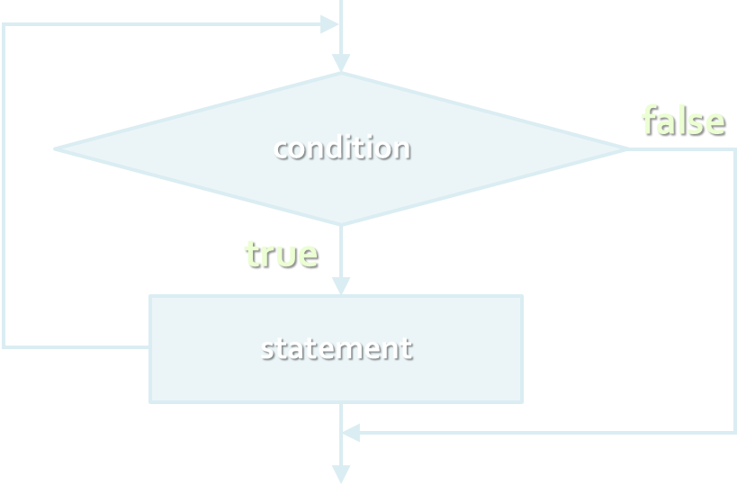

<!-- section start -->
<!-- attr: { class:'slide-title', showInPresentation:true, hasScriptWrapper:true } -->
# Loops
## Execute Blocks of Code Multiple Times
<!--  -->
<div class="signature">
	<p class="signature-course">C# Fundamentals</p>
	<p class="signature-initiative">Telerik Software Academy</p>
	<a href="https://telerikacademy.com" class="signature-link">https://telerikacademy.com</a>
</div>


<!-- section start -->
<!-- attr: { showInPresentation:true, hasScriptWrapper:true } -->
# Table of Contents
- [What is a Loop?](#/whatisloop)
- Loops in C#
  - [`while` loops](#/while)
  - [`do` … `while` loops](#/dowhile)
  - [`for` loops](#/for)
  - [`foreach` loops](#/foreach)
- Special loop operators
  - [`break`, `continue`, `goto`](#/breakcontinue)
- [Nested loops](#/nestedloops)

<!--  -->

<!-- section start -->
<!-- attr: { id:'whatisloop', class:'', showInPresentation:true, hasScriptWrapper:false } -->
# <a id="whatisloop"></a>What Is Loop?
- A `loop` is a control statement that allows repeating execution of a block of statements
  - May execute a code block fixed number of times
  - May execute a code block while given condition holds
  - May execute a code block for each member of a collection
- Loops that never end are called an `infinite loops`


<!-- section start -->
<!-- attr: { id:'while', class:'slide-section', showInPresentation:true, hasScriptWrapper:true } -->
<!-- # <a id="while"></a>Using while(…) Loop -->
<!--  -->


<!-- attr: { showInPresentation:true, hasScriptWrapper:false } -->
# How To Use While Loop?
- The simplest and most frequently used loop

```cs
while (condition)
{
    statements;
}
```

- The repeat condition
  - Returns a boolean result of `true` or `false`
  - Also called `loop condition`


<!-- attr: { showInPresentation:true, hasScriptWrapper:true } -->
# While Loop – How It Works?

<!--  -->


<!-- attr: { showInPresentation:true, hasScriptWrapper:true } -->
# While Loop – _Example_

```cs
int counter = 0;
while (counter < 10)
{
    Console.WriteLine("Number : {0}", counter);
    counter++;
}
```

<!--  -->


<!-- section start -->
<!-- attr: { class:'slide-section', showInPresentation:true, hasScriptWrapper:true } -->
<!-- # While -->
<!--  -->


<!-- attr: { showInPresentation:true, hasScriptWrapper:false } -->
# Sum 1..N – _Example_
- Calculate and print the sum of the first N natural numbers

```cs
Console.Write("n = ");
int n = int.Parse(Console.ReadLine());
int number = 1;
int sum = 1;
Console.Write("The sum 1");
while (number < n)
{
   number++;
   sum += number ;
   Console.Write("+{0}", number);
}
Console.WriteLine(" = {0}", sum);
```


<!-- attr: { class:'slide-section demo', showInPresentation:true, hasScriptWrapper:true } -->
<!-- # Calculating Sum 1..N -->
## [Demo](https://github.com/TelerikAcademy/CSharp-Part-1/tree/master/Topics/06.%20Loops/demos/Sum)
<!--  -->


<!-- attr: { showInPresentation:true, hasScriptWrapper:false } -->
# Prime Number – _Example_
- Checking whether a number is prime or not

```cs
Console.Write("Enter a positive integer number: ");
string consoleArgument=Console.ReadLine();
uint number = uint.Parse(consoleArgument);
uint divider = 2;
uint maxDivider = (uint) Math.Sqrt(number);
bool prime = true;
while (prime && (divider <= maxDivider))
{
    if (number % divider == 0)
    {
        prime = false;        
    }
    divider++;
}
Console.WriteLine("Prime? {0}", prime);
```


<!-- attr: { class:'slide-section demo', showInPresentation:true, hasScriptWrapper:true } -->
<!-- # Checking Whether a Number Is Prime -->
## [Demo](https://github.com/TelerikAcademy/CSharp-Part-1/tree/master/Topics/06.%20Loops/demos/IsPrime)
<!--  -->
<!--  -->


<!-- attr: { showInPresentation:true, hasScriptWrapper:false } -->
# Using break Operator
- `break` operator exits the inner-most loop

```cs
static void Main()
{
    int n = Convert.ToInt32(Console.ReadLine());
    // Calculate n! = 1 * 2 * ... * n
    int result = 1;
    while (true)
    {
        if (n == 1)
            break;
        result *= n;
        n--;
    }
    Console.WriteLine("n! = " + result);
}
```


<!-- attr: { class:'slide-section demo', showInPresentation:true, hasScriptWrapper:true } -->
<!-- # Calculating Factorial -->
## [Demo](https://github.com/TelerikAcademy/CSharp-Part-1/tree/master/Topics/06.%20Loops/demos/FactorialBreak)

<!--  -->


<!-- section start -->
<!-- attr: { id:'dowhile', class:'slide-section', showInPresentation:true, hasScriptWrapper:true } -->
<!-- # <a id="dowhile"></a>do { … } while (…)Loop -->
<!--  -->


<!-- attr: { showInPresentation:true, hasScriptWrapper:true } -->
# Using Do-While Loop
- Another loop structure is:

```cs
do
{
    statements;
}
while (condition);
```

- The block of statements is repeated
  - While the boolean loop condition holds
- The loop is executed at least once


<!--  -->


<!-- attr: { showInPresentation:true, hasScriptWrapper:true } -->
# Do-While Statement

<!--  -->


<!-- section start -->
<!-- attr: { class:'slide-section', showInPresentation:true, hasScriptWrapper:true } -->
<!-- # do { … } while
## _Examples_ -->
<!--  -->


<!-- attr: { showInPresentation:true, hasScriptWrapper:false } -->
# Factorial – _Example_
- Calculating N factorial

```cs
static void Main()
{
   string numberAsString = Console.ReadLine();
   int n = Convert.ToInt32(numberAsString);
   int factorial = 1;

   do
   {
      factorial *= n;
      n--;
   }
   while (n > 0);

   Console.WriteLine("n! = " + factorial);
}
```


<!-- attr: { showInPresentation:true, hasScriptWrapper:true } -->
# Factorial with BigInteger – _Example_
- Calculating N factorial with `BigInteger`

```cs
using System.Numerics;
static void Main()
{
    int n = 1000;
    BigInteger factorial = 1;
    do
    {
        factorial *= n;
        n--;
    }
    while (n > 0);
    Console.WriteLine("n! = " + factorial);
}
```

<div class="fragment balloon" style="top:34%; left:40%;">Don't forget to add reference to System.Numerics.dll.</div>


<!-- attr: { class:'slide-section demo', showInPresentation:true, hasScriptWrapper:true } -->
<!-- # Factorial (do ... while) -->
## [Demo](https://github.com/TelerikAcademy/CSharp-Part-1/tree/master/Topics/06.%20Loops/demos/FactorialDoWhile)

<!-- attr: { showInPresentation:true, hasScriptWrapper:false } -->
# Product[N..M] – _Example_
- Calculating the product of all numbers in the interval [n..m]:

```cs
int n = int.Parse(Console.ReadLine());
int m = int.Parse(Console.ReadLine());
int number = n;
decimal product = 1;
do
{		
    product *= number;
    number++;
}
while (number <= m);
Console.WriteLine("product[n..m] = " + product);
```


<!-- attr: { class:'slide-section demo', showInPresentation:true, hasScriptWrapper:true } -->
<!-- # Product of the Numbers in the Interval [n..m] -->
## [Demo](https://github.com/TelerikAcademy/CSharp-Part-1/tree/master/Topics/06.%20Loops/demos/Product)


<!-- section start -->
<!-- attr: { class:'slide-section', showInPresentation:true, hasScriptWrapper:true } -->
<!-- # for Loops -->

<!--  -->


<!-- attr: { id:'for', class:'', showInPresentation:true, hasScriptWrapper:false } -->
# <a id="for"></a>For Loops
- The typical `for` loop syntax is:

```cs
for (initialization; test; update)
{
    statements;
}
```

- Consists of
  - `Initialization` statement
  - `Boolean test` expression
  - `Update` statement
  - `Loop` body block


<!-- attr: { showInPresentation:true, hasScriptWrapper:true } -->
# The Initialization Expression

```cs
for (int number = 0; ...; ...)
{
        // Can use number here
}
// Cannot use number here
```

- Executed once, just before the loop is entered
  - Like it is out of the loop, before it
- Usually used to declare a counter variable

<div class="balloon" style="top:17%; left:13%; width:175px; height:20px; opacity: 0.3"></div>


<!-- attr: { showInPresentation:true, hasScriptWrapper:true } -->
# The Test Expression

```cs
for (int number = 0; number < 10; ...)
{    
    // Can use number here
}
// Cannot use number here
```

- Evaluated before each iteration of the loop
  - If `true`, the loop body is executed
  - If `false`, the loop body is skipped
- Used as a `loop condition`

<div class="balloon" style="top:17%; left:36%; width:135px; height:20px; opacity: 0.3"></div>


<!-- attr: { showInPresentation:true, hasScriptWrapper:true } -->
# The Update Expression

```cs
for (int number = 0; number < 10; number++)
{
       // Can use number here
}
// Cannot use number here
```

- Executed at each iteration `after` the body of the loop is finished
- Usually used to update the counter


<div class="balloon" style="top:17%; left:54%; width:100px; height:20px; opacity: 0.3"></div>


<!-- section start -->
<!-- attr: { class:'slide-section', showInPresentation:true, hasScriptWrapper:true } -->
<!-- # for Loop -->
<!--  -->


<!-- attr: { showInPresentation:true, hasScriptWrapper:false } -->
# Simple for Loop – _Example_
- A simple `for`-loop to print the numbers 0…9:

```cs
for (int number = 0; number < 10; number++)
{
    Console.Write(number + " ");
}
```

- A simple for-loop to calculate n!:

```cs
decimal factorial = 1;
for (int i = 1; i <= n; i++)
{
    factorial *= i;
}
```


<!-- attr: { showInPresentation:true, hasScriptWrapper:false } -->
# Complex for Loop – _Example_
- Complex `for`-loops could have several counter variables:

```cs
for (int i=1, sum=1; i<=128; i=i*2, sum+=i)
{
    Console.WriteLine("i={0}, sum={1}", i, sum);
}
```
- Result:

```cs
i=1, sum=1
i=2, sum=3
i=4, sum=7
i=8, sum=15
...
```


<!-- attr: { class:'slide-section demo', showInPresentation:true, hasScriptWrapper:true } -->
<!-- # For Loops -->
## [Demo](https://github.com/TelerikAcademy/CSharp-Part-1/tree/master/Topics/06.%20Loops/demos/ForLoops)
<!--  -->


<!-- attr: { showInPresentation:true, hasScriptWrapper:true } -->
# N^M – _Example_
- Calculating `n` to power `m` (denoted as `n^m`):

```cs
static void Main()
{
    int n = int.Parse(Console.ReadLine());
    int m = int.Parse(Console.ReadLine());
    decimal result = 1;
    for (int i=0; i<m; i++)
    {
        result *= n;
    }
    Console.WriteLine("n^m = " + result);
}
```


<!-- attr: { class:'slide-section demo', showInPresentation:true, hasScriptWrapper:true } -->
<!-- # Calculating N^M -->
## [Demo](https://github.com/TelerikAcademy/CSharp-Part-1/tree/master/Topics/06.%20Loops/demos/Power)


<!-- attr: { showInPresentation:true, hasScriptWrapper:false } -->
# Using continue Operator
- `continue` operator ends the iteration of the inner-most loop
- _Example_: sum all odd numbers in [1, n] that are not divisors of 7:

```cs
int n = int.Parse(Console.ReadLine());
int sum = 0;
for (int i = 1; i <= n; i += 2)
{
   if (i % 7 == 0)
   {
      continue;
   }
   sum += i;
}
Console.WriteLine("sum = {0}", sum);
```


<!-- attr: { class:'slide-section demo', showInPresentation:true, hasScriptWrapper:true } -->
<!-- # Using continue Operator -->
## [Demo](https://github.com/TelerikAcademy/CSharp-Part-1/tree/master/Topics/06.%20Loops/demos/Continue)
<!--  -->


<!-- section start -->
<!-- attr: { class:'slide-section', showInPresentation:true, hasScriptWrapper:true } -->
<!-- # foreach Loop
## iteretion over a collection of elements-->

<!-- attr: { id:'foreach', class:'', showInPresentation:true, hasScriptWrapper:false } -->
# <a id="foreach"></a>Foreach Loops
- The typical `foreach` loop syntax is:

```cs
foreach (Type element in collection)
{
    statements;
}
```

- Iterates over all elements of a collection
  - The `element` is the loop variable that takes sequentially all collection values
  - The `collection` can be list, array or other group of elements of the same type


<!-- attr: { showInPresentation:true, hasScriptWrapper:false } -->
# foreach Loop – _Example_
- _Example_ of `foreach` loop:

```cs
string[] days = {
  "Monday", "Tuesday", "Wednesday", "Thursday",
  "Friday", "Saturday", "Sunday" };
foreach (string day in days)
{
  Console.WriteLine(day);
}
```

- The above loop iterates of the array of days
  - The variable `day` takes all its values
- In the `foreach` loop we cannot set the value of the current item


<!-- attr: { class:'slide-section demo', showInPresentation:true, hasScriptWrapper:true } -->
<!-- # foreach Loop -->
## [Demo](https://github.com/TelerikAcademy/CSharp-Part-1/tree/master/Topics/06.%20Loops/demos/Foreach)

<!-- section start -->
<!-- attr: { class:'slide-section', showInPresentation:true, hasScriptWrapper:true } -->
<!-- # Nested Loops
## Using loops inside a loop -->
<!--  -->


<!-- attr: { id:'nestedloops', class:'', showInPresentation:true, hasScriptWrapper:false } -->
# <a id="nestedloops"></a>What Is Nested Loop?
- A composition of loops is called a `nested loop`
  - A loop inside another loop
- _Example_:

```cs
for (initialization; test; update)
{
    for (initialization; test; update)
    {			
        statements;
    }
    …
}
```

<!-- section start -->
<!-- attr: { class:'slide-section', showInPresentation:true, hasScriptWrapper:true } -->
<!-- # Nested Loops
## _Examples_ -->
<!--  -->


<!-- attr: { showInPresentation:true, hasScriptWrapper:false, style:'font-size:0.8em;' } -->
# Triangle – _Example_
- Print the following triangle:

     1

     1 2

     …

     1 2 3 ... n


```cs
int n = int.Parse(Console.ReadLine());
for(int row = 1; row <= n; row++)
{
   for(int column = 1; column <= row; column++)
   {
      Console.Write("{0} ", column);
   }
   Console.WriteLine();
}
```

<!-- attr: { class:'slide-section demo', showInPresentation:true, hasScriptWrapper:true } -->
<!-- # Triangle -->
## [Demo](https://github.com/TelerikAcademy/CSharp-Part-1/tree/master/Topics/06.%20Loops/demos/Triangle)


<!-- attr: { showInPresentation:true, hasScriptWrapper:false, style:'font-size:0.8em;' } -->
# Primes[N, M] – _Example_
- Print all prime numbers in the interval [n, m]:

```cs
int n = int.Parse(Console.ReadLine());
int m = int.Parse(Console.ReadLine());
for (int number = n; number <= m; number++)
{
   bool prime = true;
   int divider = 2;
   int maxDivider = Math.Sqrt(num);
   while (divider <= maxDivider)
   {
      if (number % divider == 0)
      {
         prime = false;
         break;
      }
      divider++;
   }
   if (prime)
   {
      Console.Write("{0} ", number);
   }
}
```

<!-- attr: { class:'slide-section demo', showInPresentation:true, hasScriptWrapper:true } -->
<!-- # Primes in Range [n, m] -->
## [Demo](https://github.com/TelerikAcademy/CSharp-Part-1/tree/master/Topics/06.%20Loops/demos/Primes)


<!-- attr: { id:'breakcontinue', class:'', showInPresentation:true, hasScriptWrapper:false } -->
# <a id="breakcontinue"></a>C# Jump Statements
- Jump statements are:
  - `break`, `continue`, `goto`
- How `continue` works?
  - In `while` and `do-while` loops jumps to the test expression
  - In `for` loops jumps to the update expression
- To exit an inner loop use `break`
- To exit outer loops use `goto` with a label
  - Avoid using `goto`! (it is considered harmful)


<!-- attr: { showInPresentation:true, hasScriptWrapper:true, style:'font-size:0.8em' } -->
# _C#_ Jump Statements – _Example_

```cs
int outerCounter = 0;
for (int outer = 0; outer < 10; outer++)
{    
    for (int inner = 0; inner < 10; inner++)
    {        
        if (inner % 3 == 0)
        {
            continue;
        }
        if (outer == 7)
        {
            break;
        }
        if (inner + outer > 9)
        {
            goto breakOut;
        }
    }
    outerCounter++;
}
breakOut:
```
<div class="balloon" style="top:80%; left:18%">Label</div>


<!-- section start -->
<!-- attr: { class:'slide-section', showInPresentation:true, hasScriptWrapper:true } -->
<!-- # Loops – More _Examples_ -->
<!--  -->


<!-- attr: { showInPresentation:true, hasScriptWrapper:true } -->
# Nested Loops – _Examples_
- Print all four digit numbers in format `ABCD` such that `A`+`B` = `C`+`D` (known as happy numbers)

```cs
static void Main()
{
  for (int a =1 ; a <= 9; a++)
    for (int b = 0; b <= 9; b++)
      for (int c = 0; c <= 9; c++)
        for (int d = 0; d <= 9; d++)
          if (a + b == c + d)
            Console.WriteLine("{0}{1}{2}{3}",
              a, b, c, d);
}
```

<div class="fragment balloon" style="top:35%; left:66.12%;">Can you improve this algorithm to use 3 loops only?</div>


<!-- attr: { class:'slide-section demo', showInPresentation:true, hasScriptWrapper:true } -->
<!-- # Happy Numbers -->
## [Demo](https://github.com/TelerikAcademy/CSharp-Part-1/tree/master/Topics/06.%20Loops/demos/HappyNumbers)
<!--  -->


<!-- attr: { showInPresentation:true, hasScriptWrapper:true } -->
# Nested Loops – _Examples_
- Print all combinations from TOTO 6/49

```cs
static void Main()
{		
  int i1, i2, i3, i4, i5, i6;
  for (i1 = 1; i1 <= 44; i1++)
    for (i2 = i1 + 1; i2 <= 45; i2++)
      for (i3 = i2 + 1; i3 <= 46; i3++)
        for (i4 = i3 + 1; i4 <= 47; i4++)
          for (i5 = i4 + 1; i5 <= 48; i5++)
            for (i6 = i5 + 1; i6 <= 49; i6++)
              Console.WriteLine("{0} {1} {2} {3} {4} {5}",
                i1, i2, i3, i4, i5, i6);
}		
```

<div class="fragment balloon" style="top:21.52%; left:67.00%">Warning: execution of this code could take too long time.</div>


<!-- attr: { class:'slide-section demo', showInPresentation:true, hasScriptWrapper:true } -->
<!-- # TOTO 6/49 -->
## [Demo](https://github.com/TelerikAcademy/CSharp-Part-1/tree/master/Topics/06.%20Loops/demos/Toto)
<!--  -->


<!-- attr: { showInPresentation:true, hasScriptWrapper:true } -->
# Summary
- C# supports four types of loops:
  - `while`
  - `do-while`
  - `for` loops
  - `foreach` loops
- Nested loops can be used to implement more complex logic
- The operators `continue`, `break` & `goto` can control the loop execution

<!--  -->


<!-- attr: { class:'slide-section', showInPresentation:true, hasScriptWrapper:false } -->
<!-- # Loops
## Questions? -->


<!-- attr: { showInPresentation:true, hasScriptWrapper:true } -->
# Free Trainings @ Telerik Academy
- Fundamentals of C# ProgrammingTrack of Courses
    - [csharpfundamentals.telerik.com](csharpfundamentals.telerik.com)
  - Telerik Software Academy
    - [academy.telerik.com](academy.telerik.com)
  - Telerik Academy @ Facebook
    - [facebook.com/TelerikAcademy](facebook.com/TelerikAcademy)
  - Telerik Academy Learning System
    - [telerikacademy.com](https://telerikacademy.com)

<!--  -->
<!--  -->
<!--  -->
