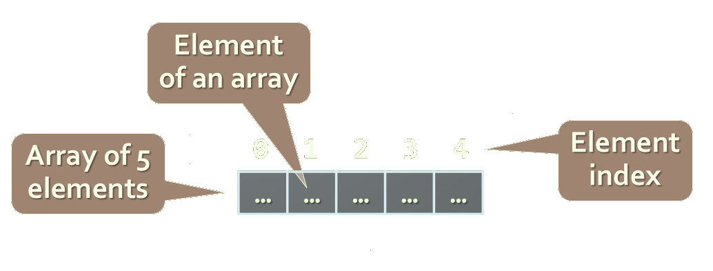
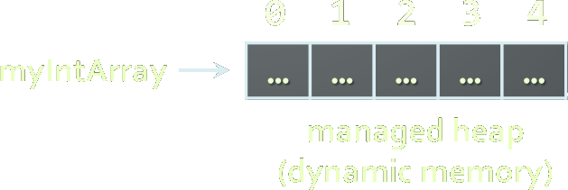
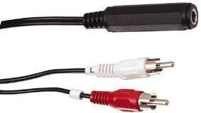
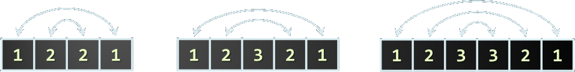

<!-- section start -->
<!-- attr: { class:'slide-title', showInPresentation:true, hasScriptWrapper:true, style:'font-size: 42px' } -->
# Arrays
## Processing Sequences of Elements
<!--  -->
<!--  -->

<div class="signature">
	<p class="signature-course">C# Advanced</p>
	<p class="signature-initiative">Telerik Software Academy</p>
	<a href="https://telerikacademy.com" class="signature-link">https://telerikacademy.com</a>
</div>


<!-- section start -->
<!-- attr: {  showInPresentation:true, hasScriptWrapper:true, style:'font-size: 42px' } -->
# Table of Contents
- [Declaring and Creating Arrays](#declare)
- [Accessing Array Elements](#access)
- [Console Input and Output of Arrays](#inout)
- [Iterating Over Arrays Using `for` and `foreach`](#iterate)
- Dynamic Arrays
  - [List &lt;T>](#lists)
- [Copying Arrays](#copy)

<!--  -->


<!-- section start -->
<!-- attr: { id:'declare', class:'slide-section', showInPresentation:true, hasScriptWrapper:true, style:'font-size: 42px' } -->
# <a id="declare"></a> Declaring and Creating Arrays
<!--  -->
<!--  -->

<!-- attr: {  showInPresentation:true, hasScriptWrapper:true, style:'font-size: 42px' } -->
# What are Arrays?
- An **array** is a sequence of elements
  - All elements are of the same type
  - The order of the elements is fixed
  - Has fixed size (**Array.Length**)

<!--  -->


<!-- attr: {  showInPresentation:true, hasScriptWrapper:true, style:'font-size: 42px' } -->
# Declaring Arrays
- Declaration defines the type of the elements
- Square brackets `[]` mean `array`
- _Examples_:
  - Declaring an array of integers:
    ```cs
    int[] myIntArray;
    ```
  - Declaring an array of strings:
    ```cs
    string[] myStringArray;
    ```


<!-- attr: {  showInPresentation:true, hasScriptWrapper:true, style:'font-size: 42px' } -->
# Creating Arrays
- Use the operator `new`
  - Specify array length
- _Example_ creating (allocating) array of 5 integers:

```cs
myIntArray = new int[5];
```
<!--  -->

<!--  -->


<!-- attr: {  showInPresentation:true, hasScriptWrapper:true, style:'font-size: 42px' } -->
# Creating and Initializing Arrays
- Creating and initializing can be done together:
```cs
myIntArray = {1, 2, 3, 4, 5};
```
- The `new` operator is not required when using curly brackets initialization

<!--  -->

<!-- attr: {  showInPresentation:true, hasScriptWrapper:true, style:'font-size: 42px' } -->
# Creating Array – _Example_
- Creating an array that contains the names of the days of the week

```cs
string[] daysOfWeek =
{
    "Monday",
    "Tuesday",
    "Wednesday",
    "Thursday",
    "Friday",
    "Saturday",
    "Sunday"
};
```

<!-- attr: { class:'slide-section demo', showInPresentation:true, hasScriptWrapper:true, style:'font-size: 42px' } -->
<!-- # Days of Week
## [Demo](https://github.com/TelerikAcademy/CSharp-Part-2/tree/master/Topics/01.%20Arrays/demos/DaysOfWeek) -->
<!--  -->


<!-- attr: {  class:'slide-section', showInPresentation:true, hasScriptWrapper:true, style:'font-size: 42px' } -->
<!-- # Accessing Array Elements
 ## Read and Modify Elements by Index -->
<!--  -->


<!-- attr: { id:'access', showInPresentation:true, hasScriptWrapper:true, style:'font-size: 42px' } -->
# <a id="access"></a>How to Access Array Element?
- Array elements are accessed using the square brackets operator `[]` (indexer)
  - Array indexer takes element’s index as parameter
  - The first element has index `0`
  - The last element has index `Length-1`
- Array elements can be retrieved and changed by using the `[]` operator


<!-- attr: { showInPresentation:true, hasScriptWrapper:true, style:'font-size: 42px' } -->
# Reversing an Array – _Example_
- Reversing the contents of an array

```cs
int[] array = new int[] {1, 2, 3, 4, 5};

// Get array size
int length = array.Length;

// Declare and create the reversed array
int[] reversed = new int[length];

// Initialize the reversed array
for (int index = 0; index < length; index++)
{
    reversed[length-index-1] = array[index];
}
```


<!-- attr: { class:'slide-section demo', showInPresentation:true, hasScriptWrapper:true, style:'font-size: 42px' } -->
<!-- # Reversing an Array
## [Demo](https://github.com/TelerikAcademy/CSharp-Part-2/tree/master/Topics/01.%20Arrays/demos/Reverse) -->
<!--  -->


<!-- section start -->
<!-- attr: {  class:'slide-section', showInPresentation:true, hasScriptWrapper:true, style:'font-size: 42px' } -->
<!-- # Arrays: Input and Output
## Reading and Printing Arrays on the Console -->
<!--  -->


<!-- attr: { id:'inout', showInPresentation:true, hasScriptWrapper:true, style:'font-size: 42px' } -->
# <a id="inout"></a>Reading Arrays From the Console
- First, read from the console the length of the array
```cs
int n = int.Parse(Console.ReadLine());
```
- Next, create the array of given size and read its elements in a `for` loop
```cs
int[] arr = new int[n];
for (int i = 0; i < n; i++)
{
      arr[i] = int.Parse(Console.ReadLine());
}
```


<!-- attr: {  showInPresentation:true, hasScriptWrapper:true, style:'font-size: 42px' } -->
# Symmetry Check – _Example_
- Read `int` array from the console and check if it is symmetric:
```cs
bool isSymmetric = true;
for (int i = 0; i < array.Length / 2; i++)
{
    if (array[i] != array[n - i - 1])
    {
        isSymmetric = false;
    }
}
```
<!--  -->


<!-- attr: { class:'slide-section demo', showInPresentation:true, hasScriptWrapper:true, style:'font-size: 42px;' } -->
<!-- # Symmetry Check
## [Demo](https://github.com/TelerikAcademy/CSharp-Part-2/tree/master/Topics/01.%20Arrays/demos/CheckSymmetry) -->
<!--  -->


<!-- attr: {  showInPresentation:true, hasScriptWrapper:true, style:'font-size: 42px' } -->
# Printing Arrays on the Console
- Process all elements of the array
- Print each element to the console
- Separate elements with white space or a new line

```cs
string[] array = {"one", "two", "three"};

// Process all elements of the array
for (int index = 0; index < array.Length; index++)
{
    // Print each element on a separate line
    Console.WriteLine("element[{0}] = {1}",
        index, array[index]);
}
```


<!-- attr: { class:'slide-section demo', showInPresentation:true, hasScriptWrapper:true, style:'font-size: 42px' } -->
<!-- # Printing Arrays
## [Demo](https://github.com/TelerikAcademy/CSharp-Part-2/tree/master/Topics/01.%20Arrays/demos/PrintArray) -->
<!--  -->


<!-- section start -->
<!-- attr: { class:'slide-section', showInPresentation:true, hasScriptWrapper:true, style:'font-size: 42px' } -->
<!-- # Processing Array Elements Using for and foreach -->
<!--  -->


<!-- attr: { id:'iterate', showInPresentation:true, hasScriptWrapper:true, style:'font-size: 42px' } -->
# <a id="iterate"></a>Processing Arrays: `for` Statement
- Use `for` loop to process an array when
  - Need to keep track of the index
  - Processing is not strictly sequential from the first to the last element
- In the loop body use the element at the loop index (`array[index]`):

```cs
for (int index = 0; index < array.Length; index++)
{
    squares[index] = array[index] * array[index];
}
```


<!-- attr: {  showInPresentation:true, hasScriptWrapper:true, style:'font-size: 42px' } -->
# Processing Arrays Using `for` Loop – _Examples_
- Printing array of integers in reversed order:
```cs
Console.WriteLine("Reversed: ");
for (int i = array.Length-1; i >= 0; i--)
{
      Console.Write(array[i] + " ");
}
// Result: 5 4 3 2 1
```
- Initialize all array elements with their corresponding index number:
```cs
for (int index = 0; index < array.Length; index++)
{
      array[index] = index;
}
```


<!-- attr: {  showInPresentation:true, hasScriptWrapper:true, style:'font-size: 42px' } -->
# Processing Arrays: `foreach`
- How `foreach` loop works?
  - `type`– the type of the element
  - `value` – local name of variable
  - `array` – processing array
```cs
foreach (type value in array)
{
    // statements
}
```
- Used when no indexing is needed
  - All elements are accessed one by one
  - Elements can not be modified (read only)


<!--  -->


<!-- attr: {  showInPresentation:true, hasScriptWrapper:true, style:'font-size: 42px' } -->
# Processing Arrays Using `foreach` – _Example_
- Print all elements of a `string[]` array:

```cs
string[] capitals =
{
    "Sofia",
    "Washington",
    "London",
    "Paris"
};
foreach (string capital in capitals)
{
    Console.WriteLine(capital);
}
```


<!-- attr: { class:'slide-section demo', showInPresentation:true, hasScriptWrapper:true, style:'font-size: 42px' } -->
<!-- # Processing Arrays
## [Demo](https://github.com/TelerikAcademy/CSharp-Part-2/tree/master/Topics/01.%20Arrays/demos/IteratingOverArrays) -->
<!--  -->


<!-- section start -->
<!-- attr: { class:'slide-section', showInPresentation:true, hasScriptWrapper:true, style:'font-size: 42px' } -->
<!-- # Resizable Arrays
 ## List&lt;T> -->
<!--  -->


<!-- attr: { id:'lists', class:'', showInPresentation:true, hasScriptWrapper:true, style:'font-size: 42px' } -->
# <a id="lists"></a> Lists (Resizable Arrays)
- <code>List&lt;T></code> – array that can be resized dynamically
  - Whenadding or removing elements
  - Also have indexers `[]` (like arrays)
  - `T` is the type that the list will hold
    - E.g. <code>List&lt;int></code> will hold `integers`
    - <code>List&lt;object></code> will hold `objects`
- Basic methods and properties
  - **Add(T** **element)** – adds new element to the end
  - **Remove(element)** – removes the element
  - **Count** – returns the current size of the list


<!-- attr: {  showInPresentation:true, hasScriptWrapper:true, style:'font-size: 42px' } -->
# List _Example_

```cs
List<int> intList = new List<int>();
for(int i = 0; i < 5; i++)
{
    intList.Add(i);
}
```

- Is the same as:

```cs
int[] intArray = new int[5];
for(int i = 0; i < 5; i++)
{
    intArray[i] = i;
}
```
- The main difference
  - When using lists we don't have to know the exact number of elements


<!-- attr: {  showInPresentation:true, hasScriptWrapper:true, style:'font-size: 40px' } -->
# Lists vs. Arrays
- Lets have an array with capacity of 5 elements
```cs
int[] intArray = new int[5];
```
- If we want to add a sixth element (we have already added 5) we have to manually resize
```cs
int[] copyArray = intArray;
int[] intArray = new int[6];
for (int i = 0; i < 5; i++)
{
      intArray[i] = copyArray[i];
}
intArray[5] = newValue;
```
- With <code>List&lt;T></code> we simply call
```cs
list.Add(newValue);
```


<!-- attr: { class:'slide-section demo', showInPresentation:true, hasScriptWrapper:true, style:'font-size: 42px' } -->
<!-- # Lists &#60;T>
## [Demo](https://github.com/TelerikAcademy/CSharp-Part-2/tree/master/Topics/01.%20Arrays/demos/Lists) -->


<!-- attr: {  showInPresentation:true, hasScriptWrapper:true, style:'font-size: 42px' } -->
# How The List<T> Works?
- Why adding new elements is not slow?
  - When adding `n` elements in <code>List&lt;T></code> it resizes itself `log(2)n` times instead of `n`
- Initially a new <code>List&lt;T></code> has size of 0 elements
  - Counter for total capacity (`Capacity`)
  - Counter for number of used capacity (`Count`)
  - When created, both properties of the list have values of 0
  - When adding the first element `Count` becomes 1 and `Capacity` becomes 4


<!-- attr: {  showInPresentation:true, hasScriptWrapper:true, style:'font-size: 40px' } -->
# How The List<T> Works?
- Initially the <code>List&lt;T></code> is empty
  - When adding new element it is resized
  - But not every time
    - Only when it is needed
- Lets have a list with 3 elements
  - It looks like this:
  <br />
  <br />
  - When we add new element it is appended to the end
  <br />
  <br />

  - Adding a fifth element doubles the Capacity of the list
<!--  -->
<!--  -->
<!--  -->


<!-- attr: { class:'slide-section demo', showInPresentation:true, hasScriptWrapper:true, style:'font-size: 42px' } -->
<!-- # Resizing Lists
## [Demo](https://github.com/TelerikAcademy/CSharp-Part-2/tree/master/Topics/01.%20Arrays/demos/ResizingLists) -->


<!-- section start -->
<!-- attr: { class:'slide-section', showInPresentation:true, hasScriptWrapper:true, style:'font-size: 42px' } -->
<!-- # Copying Arrays
## The Array Class -->


<!-- attr: { id:'copy', showInPresentation:true, hasScriptWrapper:true, style:'font-size: 42px' } -->
# <a id="copy"></a> Copying Arrays
- Sometimes we must **copy** the values from one array to another one
  - If we do it the intuitive way we would copy not only the values but the reference to the array
    - Changing some of the values in one array will affect the other
    ```cs
      int[] array = new [5] { 1, 2, 3, 4, 5 };
      int[] copyArray = array;
    ```
  - The way to avoid this is using `Clone()`
    - This way only the values will be copied but not the reference
    ```cs
      int[] array = new [5] { 1, 2, 3, 4, 5 };
      int[] copyArray = (int[])array.Clone();
    ```


<!-- section start -->
<!-- attr: {  showInPresentation:true, hasScriptWrapper:true, style:'font-size: 42px' } -->
# Summary
- Arrays are a fixed-length sequences of elements of the same type
- Array elements are accessible by index
  - Can be read and modified
- Iteration over array elements can be done with `for` and `foreach` loops
- <code>List&lt;T></code> holds resizable arrays
  - Good when we don't know the number of elements initially

<!-- attr: { class:'slide-section', showInPresentation: true, hasScriptWrapper: true, style:'font-size: 42px' } -->
<!-- # C# Arrays
## Questions? -->

<!-- attr: { showInPresentation: true, hasScriptWrapper: true} -->
# Free Training @ Telerik Academy

- Fundamentals of C# Programming Track of Courses
  - [csharpadvanced](http://academy.telerik.com/student-courses/programming/csharp-programming-part-2/about)
- Telerik Software Academy
  - [telerikacademy.com](https://telerikacademy.com)
- Telerik Academy @ Facebook
  - [facebook.com/TelerikAcademy](https://facebook.com/TelerikAcademy)
- Telerik Academy Learning System
  - [telerikacademy.com](https://telerikacademy.com)
