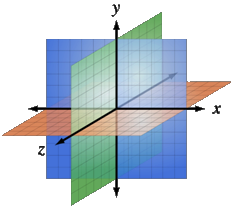
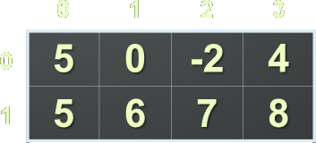
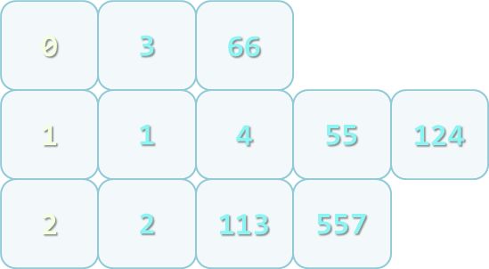
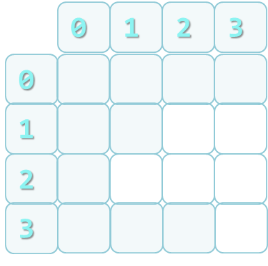
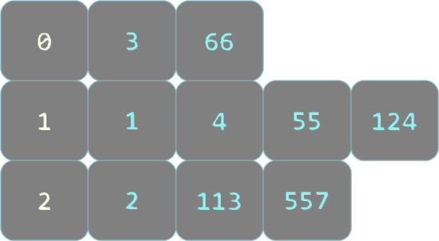
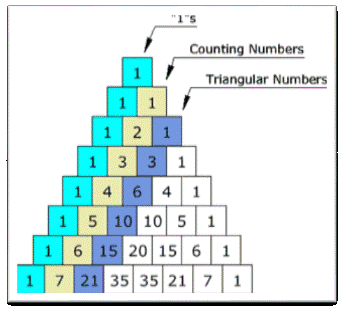
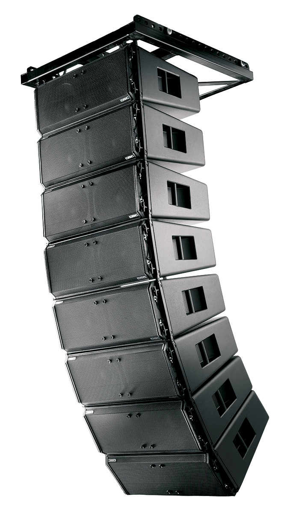
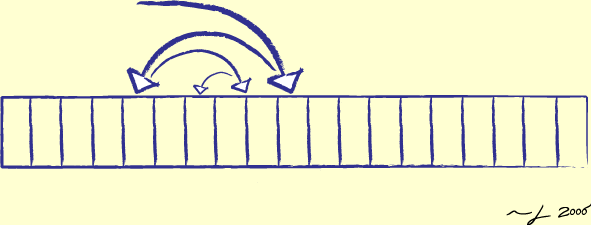

<!-- section start -->
<!-- attr: {  class:'slide-title', showInPresentation:true, hasScriptWrapper:true, style:'font-size: 42px' } -->
# Multidimensional Arrays
## Processing Matrices and Multidimensional Tables
<!--  -->
<!--  -->

<div class="signature">
	<p class="signature-course">C# Advanced</p>
	<p class="signature-initiative">Telerik Software Academy</p>
	<a href="https://telerikacademy.com" class="signature-link">https://telerikacademy.com</a>
</div>

<!-- section start -->
<!-- attr: { showInPresentation:true, hasScriptWrapper:true, style:'font-size: 42px' } -->
# Table of Contents
- [Matrices and Multidimensional Arrays](#multidimensional)
  - [Declaring](#delaring)
  - [Usage](#usage)
- Jagged Arrays
  - [Declaring](#jaggeddeclare)
  - [Usage](#jaggedusage)
- [The **Array** Class](#arrayclass)
  - [Sorting](#sorting)
  - [Binary Search](#binarysearch)
- [Advices](#advices)

<!-- section start -->
<!-- attr: { id:'multidimensional', class:'slide-section', showInPresentation:true, hasScriptWrapper:true, style:'font-size: 42px' } -->
# <a id="multidimensional"></a> Multidimensional Arrays
## Using Array of Arrays, Matrices and Cubes
<!--  -->

<!-- attr: {  showInPresentation:true, hasScriptWrapper:true, style:'font-size: 42px' } -->
# What is a Multidimensional Array?
- **Multidimensional arrays** have more than one dimension (2, 3, … n)
  - The most important multidimensional arrays are the 2-dimensional
    - Known as **matrices** or **tables**
- _Example_ of matrix of integers with 2 rows and 4 columns:
<!--  -->

<!-- attr: { id:'delaring',  showInPresentation:true, hasScriptWrapper:true, style:'font-size: 42px' } -->
# <a id="delaring"></a> Declaring and Creating Multidimensional Arrays
- Declaring multidimensional arrays:

```cs
int[,] intMatrix;
float[,] floatMatrix;
string[,,] strCube;
```
- Creating a multidimensional array
  - Use the `new` keyword
  - Must specify the size of each dimension

```cs
int[,] intMatrix = new int[3, 4];
float[,] floatMatrix = new float[8, 2];
string[,,] stringCube = new string[5, 5, 5];
```

<!-- attr: { id:'usage',  showInPresentation:true, hasScriptWrapper:true, style:'font-size: 42px' } -->
# <a id="usage"></a> Initializing Multidimensional Arrays with Values
- Creating and initializing with values multidimensional array:

```cs
int[,] matrix =
{
      { 1, 2, 3, 4 }, // row 0 values
      { 5, 6, 7, 8 }, // row 1 values
}; // The matrix size is 2 x 4 (2 rows, 4 cols)
```
  - Matrices are represented by a list of rows
    - Rows consist of list of values
  - The first dimension comes first, the second comes next (inside the first)


<!-- attr: { showInPresentation:true, hasScriptWrapper:true, style:'font-size: 42px' } -->
# Accessing The Elements of Multidimensional Arrays
- Accessing N-dimensional array element:

```cs
nDimensionalArray[index1, … , indexn]
```
- Getting element value example:

```cs
int[,] array = {{1, 2}, {3, 4}}
int element11 = array[1, 1]; // element11 = 4
```
- Setting element value example:

```cs
int[,] array = new int[3, 4];
for (int row = 0; row < array.GetLength(0); row++)
    for (int col = 0; col < array.GetLength(1); col++)
        array[row, col] = row + col;
```

<!-- attr: { showInPresentation:true, hasScriptWrapper:true, style:'font-size: 42px' } -->
# Reading a Matrix – _Example_
- Reading a matrix from the console

```cs
int rows = int.Parse(Console.ReadLine());
int columns = int.Parse(Console.ReadLine());

int[,] matrix = new int[rows, columns];

for (int row = 0; row < rows; row++)
{
    for (int column = 0; column < cols; column++)
    {
          Console.Write("matrix[{0},{1}] = ", row, column);
          matrix[row, column] = int.Parse(Console.ReadLine());
    }
}
```

<!-- attr: {   showInPresentation:true, hasScriptWrapper:true, style:'font-size: 42px' } -->
# Printing Matrix – _Example_
- Printing a matrix on the console:

```cs
for (int row = 0; row < matrix.GetLength(0); row++)
{
    for (int col = 0; col < matrix.GetLength(1); col++)
    {
        Console.Write("{0, 4}", matrix[row, col]);
    }

    Console.WriteLine();
}
```


<!-- attr: {  class:'slide-section demo', showInPresentation:true, hasScriptWrapper:true, style:'font-size: 42px' } -->
<!-- # Reading and Printing Matrices
## [Demo](https://github.com/TelerikAcademy/CSharp-Part-2/tree/master/Topics/02.%20Multidimensional-Arrays/demos/ReadWriteMatrix) -->
<!--  -->


<!-- attr: {   showInPresentation:true, hasScriptWrapper:true, style:'font-size: 40px' } -->
# Maximal Platform – _Example_
- Finding a 2 x 2 platform in a matrix with a maximal sum of its elements

```cs
int[,] matrix =
{
    {7, 1, 3, 3, 2, 1},
    {1, 3, 9, 8, 5, 6},
    {4, 6, 7, 9, 1, 0}
};
int bestSum = int.MinValue;
for (int row = 0; row < matrix.GetLength(0) - 1; row++)
{
    for (int col = 0; col < matrix.GetLength(1) - 1; col++)
    {
        int sum = matrix[row, col] + matrix[row, col + 1] +
                  matrix[row + 1, col] +
				  matrix[row + 1, col + 1];
        if (sum > bestSum)
            bestSum = sum;
    }
}
```

<div class="balloon" style="position: absolute; top: 41%; left:20%; width:3%; height: 7%; opacity:0.3;"></div>


<!-- attr: {  class:'slide-section demo', showInPresentation:true, hasScriptWrapper:true, style:'font-size: 42px' } -->
<!-- # Maximal Platform
## [Demo](https://github.com/TelerikAcademy/CSharp-Part-2/tree/master/Topics/02.%20Multidimensional-Arrays/demos/MaxPlatform) -->
<!--  -->


<!-- section start -->
<!-- attr: { class:'slide-section', showInPresentation:true, hasScriptWrapper:true, style:'font-size: 42px' } -->
<!-- # Jagged Arrays -->
## What are Jagged Arrays and How to Use Them?
<!--  -->



<!-- attr: { id:'jaggeddeclare',  showInPresentation:true, hasScriptWrapper:true, style:'font-size: 38px' } -->
# <a id="jaggeddeclare"></a> Jagged Arrays
- Jagged arrays are like multidimensional arrays
  - But each dimension has different size
  - A jagged array is array of arrays
  - Each of the arrays has it's own length
- How to create jagged array?

```cs
int[][] jagged = new int[3][];
jagged[0] = new int[3];
jagged[1] = new int[2];
jagged[2] = new int[5];
```

<!--  -->


<!-- attr: {   showInPresentation:true, hasScriptWrapper:true, style:'font-size: 42px' } -->
# Initialization of Jagged Arrays
- When creating jagged arrays
  - Initially the array is created of `null` arrays
    - all .NET arrays are reference types - [**read more**](https://msdn.microsoft.com/en-us/library/bb985948.aspx)
  - Need to initialize each one of them

```cs
int n = int.Parse(Console.ReadLine());
int[][] jaggedArray = new int[n][];

for (int i = 0; i < n; i++)
{
   jaggedArray[i] = new int[i];
}
```


<!-- attr: {  class:'slide-section demo', showInPresentation:true, hasScriptWrapper:true, style:'font-size: 42px' } -->
<!-- # Jagged Arrays
## [Demo](https://github.com/TelerikAcademy/CSharp-Part-2/tree/master/Topics/02.%20Multidimensional-Arrays/demos/JaggedArrays) -->
<!--  -->
<!--  -->


<!-- attr: { id:'jaggedusage',  showInPresentation:true, hasScriptWrapper:true, style:'font-size: 42px' } -->
# <a id="jaggedusage"></a> _Example_ of Jagged Arrays
- Check a set of numbers and group them by their remainder when divided by `3` (`0, 1 and 2`)
- _Example_: `0, 1, 4, 113, 55, 3, 1, 2, 66, 557, 124, 2`
- First we need to count the numbers
  - Done with an iteration
- Allocate jagged arrays with the appropriate size
- Each number is added into its jagged array
<!--  -->


<!-- attr: {   showInPresentation:true, hasScriptWrapper:true, style:'font-size: 42px' } -->
# _Example_ of Jagged Arrays

```cs
int[] numbers = {0, 1, 4, 113, 55, 3, 1, 2, 66, 557, 124, 2};
int[] sizes = new int[3];
int[] offsets = new int[3];
foreach (var number in numbers)
{
      int remainder = number % 3;
      sizes[remainder]++;
}
int[][] numbersByRemainder = new int[3][]
{
      new int[sizes[0]],
      new int[sizes[1]],
      new int[sizes[2]]
};
foreach (var number in numbers)
{
      int remainder = number % 3;
      int index = offsets[remainder];
      numbersByRemainder[remainder][index] = number;
      offsets[remainder]++;
}
```

<!--  -->


<!-- attr: {  class:'slide-section demo', showInPresentation:true, hasScriptWrapper:true, style:'font-size: 42px' } -->
<!-- # Pascal's Triangle
## [Demo](https://github.com/TelerikAcademy/CSharp-Part-2/tree/master/Topics/02.%20Multidimensional-Arrays/demos/PascalTriangle) -->
<!--  -->


<!-- attr: {  class:'slide-section demo', showInPresentation:true, hasScriptWrapper:true, style:'font-size: 42px' } -->
<!-- # Matrix Multiplication
## [Demo](https://github.com/TelerikAcademy/CSharp-Part-2/tree/master/Topics/02.%20Multidimensional-Arrays/demos/Matrix%20Multiplication) -->
<!--  -->


<!-- section start -->
<!-- attr: {  class:'slide-section', showInPresentation:true, hasScriptWrapper:true, style:'font-size: 42px' } -->
<!-- # Array Class
## What Can We Use? -->
<!--  -->


<!-- attr: { id:'arrayclass', showInPresentation:true, hasScriptWrapper:true, style:'font-size: 42px' } -->
# <a id="arrayclass"></a>The Array Class
- The `System.Array` class
  - Parent of all arrays
  - All arrays inherit from it
  - All arrays have the same:
    - Basic functionality
    - Basic properties
    - E.g. `Length` property

<!--  -->


<!-- attr: {   showInPresentation:true, hasScriptWrapper:true, style:'font-size: 42px' } -->
# Methods of Array
- Important methods and properties of `System.Array`
  - `Rank` – number of dimensions
  - `Length` – number of all elements through all dimensions
  - `GetLength(index)` – returns the number of elements in the specified dimension
    - Dimensions are numbered from 0
    - _Example_: for a 2D array, GetLength(0) returns the rows count and GetLength(1) returns the columns count


<!-- attr: {   showInPresentation:true, hasScriptWrapper:true, style:'font-size: 42px' } -->
<!-- # Methods of Array -->
- `GetEnumerator()` – returns `IEnumerator` for the array elements
- `BinarySearch(…)` – searches for a given element into a sorted array (uses binary search)
- `IndexOf(…)` – searches for a given element and returns the index of the first occurrence (if any)
- `LastIndexOf(…)` – searches for a given element and returns the last occurrence index
- `Copy(src, dest, len)` – copies array elements; has many overloads


<!-- attr: {   showInPresentation:true, hasScriptWrapper:true, style:'font-size: 42px' } -->
<!-- # Methods of Array -->
- `Reverse(…)` – inverts the arrays elements upside down
- `Clear(…)` – assigns value 0 (null) for each elements
- `CreateInstance(…)` – creates an array
  - Accepts as parameters the number of dimensions, start index and number of elements
- Implements `ICloneable`, `IList`, `ICollection` and `IEnumerable` interfaces

<!-- section start -->
<!-- attr: { id:'sorting', class:'slide-section', showInPresentation:true, hasScriptWrapper:true, style:'font-size: 42px' } -->
# <a id="sorting"></a> Sorting Arrays
<!--  -->


<!-- attr: { showInPresentation:true, hasScriptWrapper:true, style:'font-size: 42px' } -->
# Sorting Arrays
- Sorting in .NET is usually done with `System.Array.Sort()`
  - `Sort(Array)` – sorts array elements
    - Elements should implement `IComparable`
  - `Sort(Array, IComparer)` – sorts array elements by given external `IComparer`
  - <code>Sort(Array, Comparison&lt;T>)</code> – sorts array elements by given comparison operation
    - Can be used with lambda expression


<!-- attr: { showInPresentation:true, hasScriptWrapper:true, style:'font-size: 42px' } -->
# Sorting Arrays – _Example_

```cs
static void Main()
{
    string[] beers =
    {
        "Zagorka", "Ariana", "Shumensko",
        "Astika", "Kamenitza", "Bolqrka",
        "Amstel"
    };
    Console.WriteLine("Unsorted: {0}", string.Join(", ", beers));
    // Elements of beers array are of string type,
    // which implement IComparable
    Array.Sort(beers);
    Console.WriteLine("Sorted: {0}", string.Join(", ", beers));
    // Result: Sorted: Amstel, Ariana, Astika,
    // Bolyarka, Kamenitza, Shumensko, Zagorka
}
```


<!-- attr: { showInPresentation:true, hasScriptWrapper:true, style:'font-size: 42px' } -->
# Sorting with IComparer&lt;T> and Lambda Expressions – _Example_

```cs
class Student
{
    public int Age { get; set; }
    …
}
public class StudentAgeComparer : IComparer<Student>
{
    public int Compare(Student first, Student second)
    {
       return first.Age.CompareTo(second.Age);
    }
}
…
// using IComparer<Student>
Array.Sort(students, new StudentAgeComparer());
…
// using lambda expression
Array.Sort(students, (x, y) => x.Name.CompareTo(y.Name));
```


<!-- attr: {  class:'slide-section demo', showInPresentation:true, hasScriptWrapper:true, style:'font-size: 42px' } -->
<!-- # Sorting with IComparer&lt;T> and Lambda Expressions
## [Demo](https://github.com/TelerikAcademy/CSharp-Part-2/tree/master/Topics/02.%20Multidimensional-Arrays/demos/SortingIComparer) -->
<!--  -->
<!--  -->


<!-- section start -->
<!-- attr: { id:'binarysearch', class:'slide-section', showInPresentation:true, hasScriptWrapper:true, style:'font-size: 42px' } -->
# <a id="binarysearch"></a> Binary Search
<!--  -->


<!-- attr: { showInPresentation:true, hasScriptWrapper:true, style:'font-size: 42px' } -->
# Binary Search
- Binary search is a fast method for searching for an element in a sorted array
  - Has guaranteed running time of `O(log(n))` for searching among arrays of with `n` elements
- Implemented in the `Array.BinarySearch( Array, object)` method
  - Returns the index of the found object or a negative number when not found


<!-- attr: { showInPresentation:true, hasScriptWrapper:true, style:'font-size: 42px' } -->
<!-- # Binary Search -->
- All requirements of the `Sort()` method are applicable for `BinarySearch()`
  -  Either all elements should implement <code>IComparable&lt;T></code> or instance of <code>IComparer&lt;T></code> should be passed


<!-- attr: { showInPresentation:true, hasScriptWrapper:true, style:'font-size: 42px' } -->
# Binary Search – _Example_

```cs
static void Main()
{
    string[] beers =
    {
      "Zagorka", "Ariana", "Shumensko",
      "Astika", "Kamenitza", "Bolqrka",
      "Amstel"
    };
    Array.Sort(beers);

    string target = "Astika";

    int index = Array.BinarySearch(beers, target);
    Console.WriteLine("{0} found at index {1}", target, index);
    // Result: Astika found at index 2

    target = "Heineken";
    index = Array.BinarySearch(beers, target);
    Console.WriteLine("{0} not found (index={1})", target, index);
    // Result: Heineken not found (index=-5)
}
```


<!-- attr: { class:'slide-section demo', showInPresentation:true, hasScriptWrapper:true, style:'font-size: 42px' } -->
<!-- # Binary Search
## [Demo](https://github.com/TelerikAcademy/CSharp-Part-2/tree/master/Topics/02.%20Multidimensional-Arrays/demos/BinarySearch) -->
<!--  -->


<!-- section start -->
<!-- attr: {  class:'slide-section', showInPresentation:true, hasScriptWrapper:true, style:'font-size: 42px' } -->
<!-- # Working with Arrays
 ## Best Practices -->
<!--  -->


<!-- attr: { id:'advices',  showInPresentation:true, hasScriptWrapper:true, style:'font-size: 42px' } -->
# <a id="advices"></a> Advices for Working with Arrays
- When a given method returns an array, it should return an empty array (array with 0 elements) instead of `null`
- Arrays are passed by reference
  - To be sure that given method will not change the passed array, pass a copy of it
- `Clone()` returns shallow copy of the array
  - You should implement your own deep clone when working with **custom** reference types

<!-- section start -->
<!-- attr: { class:'slide-section', showInPresentation: true, hasScriptWrapper: true, style:'font-size: 42px' } -->
<!-- # C# Multidimensional Arrays
## Questions? -->

<!-- attr: { showInPresentation: true, hasScriptWrapper: true} -->
# Free Training @ Telerik Academy

- Fundamentals of C# Programming Track of Courses
  - [csharpadvanced](http://academy.telerik.com/student-courses/programming/csharp-programming-part-2/about)
- Telerik Software Academy
  - [telerikacademy.com](https://telerikacademy.com)
- Telerik Academy @ Facebook
  - [facebook.com/TelerikAcademy](https://facebook.com/TelerikAcademy)
- Telerik Academy Learning System
  - [telerikacademy.com](https://telerikacademy.com)
