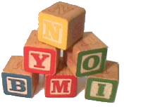
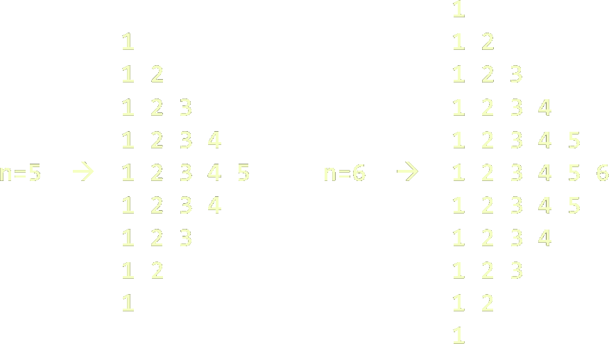
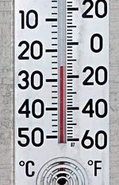
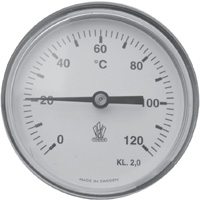

<!-- section start -->
<!-- attr: {  class:'slide-title', showInPresentation:true, hasScriptWrapper:true, style:'font-size: 42px' } -->
# Methods
## Subroutines in Computer Programming

<!--  -->


<div class="signature">
	<p class="signature-course">C# Advanced</p>
	<p class="signature-initiative">Telerik Software Academy</p>
	<a href="https://telerikacademy.com" class="signature-link">https://telerikacademy.com</a>
</div>


<!-- section start -->
<!-- attr: {  showInPresentation:true, hasScriptWrapper:true, style:'font-size: 42px' } -->
# Table of Contents
- Using Methods
  - [What is a Method? Why to Use Methods?](#method)
  - [Using methods](#using)
  - [Declaring and Creating Methods](#declare)
  - [Calling Methods](#calling)
- [Methods with Parameters](#parameters)
  - [Passing Parameters](#passing)
  - [Returning Values](#return)
- [Best Practices](#best)


<!-- attr: { id:'method',  showInPresentation:true, hasScriptWrapper:true, style:'font-size: 42px' } -->
# <a id="method"></a> What is a Method?
- A **method** is a kind of building block that solves a small problem
  - A piece of code that has a name and can be called from the other code
  - Can take parameters and return a value
- Methods allow programmers to construct large programs from simple pieces
- Methods are also known as **functions**, **procedures**, and **subroutines**


<!-- attr: { id:'using',  showInPresentation:true, hasScriptWrapper:true, style:'font-size: 42px' } -->
# <a id="using"></a> Why to Use Methods?
- More manageable programming
  - Split large problems into small pieces
  - Better organization of the program
  - Improve code readability
  - Improve code understandability
- Avoiding repeating code
    - Improve code maintainability
- Code reusability
  - Using existing methods several times

<!-- class="slide-image"  -->


<!-- section start -->
<!-- attr: {  class:'slide-section', showInPresentation:true, hasScriptWrapper:true, style:'font-size: 42px' } -->
<!-- #  Declaring and Creating Methods

 -->


<!-- attr: { id:'declare', showInPresentation:true, hasScriptWrapper:true, style:'font-size: 42px' } -->
# <a id="declare"></a> Declaring and Creating Methods
```cs
static void PrintLogo() // PrintLogo is the method's name
{
    Console.WriteLine("Telerik Corp.");
    Console.WriteLine("www.telerik.com");
}
```
- Each method has a **name**
  - It is used to call the method
  - Describes the method's purpose


<!-- attr: {  showInPresentation:true, hasScriptWrapper:true, style:'font-size: 42px' } -->
# Declaring and Creating Methods
```cs
static void PrintLogo()
{
    Console.WriteLine("Telerik Corp.");
    Console.WriteLine("www.telerik.com");
}
```
- Methods declared `static` can be called by any other method (static or not)
  - This will be discussed later in details
- The keyword `void` means that the method does not return any result


<!-- attr: {  showInPresentation:true, hasScriptWrapper:true, style:'font-size: 42px' } -->
# Declaring and Creating Methods

```cs
static void PrintLogo()
{
    Console.WriteLine("Telerik Corp.");
    Console.WriteLine("www.telerik.com");
}
```

- Each method has a **body**
  - It contains the programming code
  - Surrounded by `{` and `}`
<div class="fragment balloon" style="top:22%; left:60%;">Method body</div>


<!-- attr: {  showInPresentation:true, hasScriptWrapper:true, style:'font-size: 42px' } -->
<!-- # Declaring and Creating Methods -->

```cs
using System;

class Method_Example_
{
    static void PrintLogo()
    {
        Console.WriteLine("Telerik Corp.");
        Console.WriteLine("www.telerik.com");
    }

    static void Main()
    {
        // ...
    }
}
```

- Methods are always declared inside a `class`
- `Main()` is also a method like all others


<!-- section start -->
<!-- attr: { class:'slide-section', showInPresentation:true, hasScriptWrapper:true, style:'font-size: 42px' } -->
<!-- # Calling Methods
 -->


<!-- attr: { id:'calling', showInPresentation:true, hasScriptWrapper:true, style:'font-size: 42px' } -->
# <a id="calling"></a> Calling Methods
- To call a method, simply use:
  - The method’s name
  - Parentheses (don’t forget them!)
  - A semicolon (`;`)

```cs
PrintLogo();
```
- This will execute the code in the method’s body and will result in printing the following:

```cs
Telerik Corp.
www.telerik.com
```


<!-- attr: {  showInPresentation:true, hasScriptWrapper:true, style:'font-size: 42px' } -->
# Calling Methods
- A method can be called from:
  - The `Main()` method
  - Any other method
  - Itself (process known as **recursion**)

```cs
static void Main()
{
    // ...
    PrintLogo();
    // ...
}
```


<!-- attr: {  class:'slide-section demo', showInPresentation:true, hasScriptWrapper:true, style:'font-size: 42px' } -->
<!-- # Declaring and Calling Methods
## [Demo](https://github.com/TelerikAcademy/CSharp-Part-2/tree/master/Topics/03.%20Methods/demos/PrintLogo) -->

<!-- section start -->
<!-- attr: { class:'slide-section', showInPresentation:true, hasScriptWrapper:true, style:'font-size: 42px' } -->
<!-- # Methods with Parameters
 ## Passing Parameters and Returning values -->
<!--  -->


<!-- attr: { id:'parameters', showInPresentation:true, hasScriptWrapper:true, style:'font-size: 42px' } -->
# <a id="parameters"></a> Method Parameters
- To pass information to a method, you can use `parameters`(also known as `arguments`)
  - You can pass zero or several input values
  - You can pass values of different types
  - Each parameter has name and type
  - Parameters are assigned to particular values when the method is called
- Parameters can change the method behavior depending on the passed values


<!-- attr: {  showInPresentation:true, hasScriptWrapper:true, style:'font-size: 42px' } -->
# Defining and Using Method Parameters
```cs
static void PrintSign(int number)
{
      if (number > 0)
          Console.WriteLine("Positive");
      else if (number < 0)
          Console.WriteLine("Negative");
      else
          Console.WriteLine("Zero");
}
```
- Method’s behavior depends on its parameters
- Parameters can be of any type
  - `int`, `double`, `string`, etc.
  - Arrays (`int[]`, `double[]`, etc.)


<!-- attr: {  showInPresentation:true, hasScriptWrapper:true, style:'font-size: 42px' } -->
<!-- # Defining and Using Method Parameters -->
- Methods can have as many parameters as needed:

```cs
static void PrintMax(float number1, float number2)
{
      float max = number1;
      if (number2 > number1)
          max = number2;
      Console.WriteLine("Maximal number: {0}", max);
}
```
- The following syntax is not valid:

```cs
static void PrintMax(float number1, number2)
```


<!-- attr: { id:'passing',  showInPresentation:true, hasScriptWrapper:true, style:'font-size: 42px' } -->
# <a id="passing"></a> Calling Methods with Parameters
- To call a method and pass values to its parameters:
  - Use the method’s name, followed by a list of expressions for each parameter
- _Examples_:

```cs
PrintSign(-5);
PrintSign(balance);
PrintSign(2+3);

PrintMax(100, 200);
PrintMax(oldQuantity * 1.5, quantity * 2);
```


<!-- attr: {  showInPresentation:true, hasScriptWrapper:true, style:'font-size: 42px' } -->
# Calling Methods with Parameters
- Expressions must be of the same type as method’s parameters (or compatible)
  - If the method requires a `float` expression, you can pass `int` instead
- Use the same order like in method declaration
- For methods with no parameters do not forget the parentheses


<!-- section start -->
<!-- attr: {  class:'slide-section', showInPresentation:true, hasScriptWrapper:true, style:'font-size: 42px' } -->
<!-- # Using Methods With Parameters
## Examples -->


<!-- attr: {  showInPresentation:true, hasScriptWrapper:true, style:'font-size: 42px' } -->
<!-- # Methods Parameters – _Example_ -->

```cs
static void PrintSign(int number)
{
  if (number > 0)
    Console.WriteLine("The number {0} is positive.", number);
  else if (number < 0)
    Console.WriteLine("The number {0} is negative.", number);
  else
    Console.WriteLine("The number {0} is zero.", number);
}
static void PrintMax(float number1, float number2)
{
  float max = number1;
  if (number2 > number1)
  {
    max = number2;
  }
  Console.WriteLine("Maximal number: {0}", max);
}
```


<!-- attr: {  class:'slide-section demo', showInPresentation:true, hasScriptWrapper:true, style:'font-size: 42px' } -->
<!-- # Method Parameters
## [Demo](https://github.com/TelerikAcademy/CSharp-Part-2/tree/master/Topics/03.%20Methods/demos/MethodsParameters) -->


<!-- attr: {  showInPresentation:true, hasScriptWrapper:true, style:'font-size: 42px' } -->
# Months – _Example_
- Display the period between two months in a user-friendly way

```cs
using System;

class MonthsExample
{
  static void SayMonth(int month)
  {
    string[] monthNames = new string[] {
      "January", "February", "March",
      "April", "May", "June", "July",
      "August", "September", "October",
      "November", "December"};
      Console.Write(monthNames[month-1]);
  }

```

_(the example continues)_

<!-- attr: {  showInPresentation:true, hasScriptWrapper:true, style:'font-size: 42px' } -->
# Months – _Example_

```cs
  static void SayPeriod(int startMonth, int endMonth)
  {
    int period = endMonth - startMonth;
    if (period < 0)
    {
      period = period + 12;
      // From December to January the
      // period is 1 month, not -11!
    }
    Console.Write("There are {0} + months from ", period);
    SayMonth(startMonth);
    Console.Write(" to ");
    SayMonth(endMonth);
  }
}
```


<!-- attr: {  class:'slide-section demo', showInPresentation:true, hasScriptWrapper:true, style:'font-size: 42px' } -->
<!-- # Months
## [Demo](https://github.com/TelerikAcademy/CSharp-Part-2/tree/master/Topics/03.%20Methods/demos/Months) -->
<!--  -->


<!-- attr: {  showInPresentation:true, hasScriptWrapper:true, style:'font-size: 42px' } -->
<!-- # Printing Triangle – _Example_ -->
- Creating a program for printing triangles as shown below:

<!--  -->


<!-- attr: {  showInPresentation:true, hasScriptWrapper:true, style:'font-size: 42px' } -->
# Printing Triangle – _Example_

```cs
static void Main()
{
    int n = int.Parse(Console.ReadLine());
    for (int line = 1; line <= n; line++)
        PrintLine(1, line);
    for (int line = n-1; line >= 1; line--)
        PrintLine(1, line);
}

static void PrintLine(int start, int end)
{
    for (int i = start; i <= end; i++)
    {
        Console.Write(" {0}", i);
    }
    Console.WriteLine();
}
```


<!-- attr: {  class:'slide-section demo', showInPresentation:true, hasScriptWrapper:true, style:'font-size: 42px' } -->
<!-- # Printing Triangle
## [Demo](https://github.com/TelerikAcademy/CSharp-Part-2/tree/master/Topics/03.%20Methods/demos/Triangle) -->

<!-- 
 -->


<!-- attr: {  showInPresentation:true, hasScriptWrapper:true, style:'font-size: 42px' } -->
# Optional Parameters
- C# supports **optional parameters** since v4.0 with default values assigned at their declaration:
```cs
static void PrintNumbers(int start = 0, int end = 100)
{
      for (int i = start; i <= end; i++)
      {
            Console.Write("{0} ", i);
      }
}
```
- The above method can be called in several ways:
```cs
PrintNumbers(5, 10);
PrintNumbers(15);
PrintNumbers();
PrintNumbers(end: 40, start: 35);
```

<!-- attr: {  class:'slide-section demo', showInPresentation:true, hasScriptWrapper:true, style:'font-size: 42px' } -->
<!-- # Optional Parameters
## [Demo](https://github.com/TelerikAcademy/CSharp-Part-2/tree/master/Topics/03.%20Methods/demos/OptionalParameters) -->


<!-- section start -->
<!-- attr: { class:'slide-section', showInPresentation:true, hasScriptWrapper:true, style:'font-size: 42px' } -->
<!-- # Returning Values From Methods
 -->


<!-- attr: { id:'return', showInPresentation:true, hasScriptWrapper:true, style:'font-size: 42px' } -->
# <a id="return"></a> Returning Values From Methods
- A method can `return` a value to its caller
- Returned value:
  - Can be assigned to a variable:

  ```cs
  string message = Console.ReadLine();
  // Console.ReadLine() returns a string
  ```
  - Can be used in expressions:

  ```cs
  float price = GetPrice() * quantity * 1.20;
  ```
  - Can be passed to another method:

  ```cs
  int age = int.Parse(Console.ReadLine());
  ```


<!-- attr: {  showInPresentation:true, hasScriptWrapper:true, style:'font-size: 40px' } -->
# Defining Methods That Return a Value
- Instead of `void`, specify the type of data to return
```cs
static int Multiply(int firstNum, int secondNum)
{
    return firstNum * secondNum;
}
```
- Methods can return any type of data (`int`, `string`, array, etc.)
- `void` methods do not return anything
- The combination of method's name and parameters is called **method signature**
- Use `return` keyword to return a result


<!-- attr: {  showInPresentation:true, hasScriptWrapper:true, style:'font-size: 38px' } -->
# The `return` Statement
- The `return` statement:
  - Immediately terminates method’s execution
  - Returns specified expression to the caller
  - _Example_:

    ```cs
    int SomeMethod()
    {
        return -1; // optional before and after the return statement
    }
    ```
- To terminate `void` method, use just:

```cs
void SomeVoidMethod()
{
    return; // optional before and after the return statement
}
```

- `return` can be used several times in a method body


<!-- section start -->
<!-- attr: {  class:'slide-section', showInPresentation:true, hasScriptWrapper:true, style:'font-size: 42px' } -->
<!-- # Returning Values From Methods
 ## _Examples_ -->


<!-- attr: {  showInPresentation:true, hasScriptWrapper:true, style:'font-size: 42px' } -->
# Temperature Conversion – _Example_
- Convert temperature from Fahrenheit to Celsius:

```cs
static double FahrenheitToCelsius(double degrees)
{
    double celsius = (degrees - 32) * 5 / 9;
    return celsius;
}

static void Main()
{
    Console.Write("Temperature in Fahrenheit: ");
    double t = Double.Parse(Console.ReadLine());
    t = FahrenheitToCelsius(t);
    Console.Write("Temperature in Celsius: {0}", t);
}
```


<!-- attr: {  class:'slide-section demo', showInPresentation:true, hasScriptWrapper:true, style:'font-size: 42px' } -->
<!-- # Temperature Conversion
## [Demo](https://github.com/TelerikAcademy/CSharp-Part-2/tree/master/Topics/03.%20Methods/demos/Temperature) -->

<!-- 
 -->


<!-- attr: {  showInPresentation:true, hasScriptWrapper:true, style:'font-size: 42px' } -->
# Positive Numbers – _Example_
- Check if all numbers in a sequence are positive:

```cs
static bool ArePositive(int[] sequence)
{
    foreach (int number in sequence)
    {
        if (number <= 0)
        {
            return false;
        }
    }
    return true;
}
```


<!-- attr: {  class:'slide-section demo', showInPresentation:true, hasScriptWrapper:true, style:'font-size: 42px' } -->
<!-- # Positive Numbers
## [Demo](https://github.com/TelerikAcademy/CSharp-Part-2/tree/master/Topics/03.%20Methods/demos/PositiveNumbers) -->

<!--  -->


<!-- attr: {  showInPresentation:true, hasScriptWrapper:true, style:'font-size: 42px' } -->
# Data Validation – _Example_

- Validating input data:

```cs
using System;

class ValidatingDemo
{
  static void Main()
  {
    Console.WriteLine("What time is it?");

    Console.Write("Hours: ");
    int hours = int.Parse(Console.ReadLine());

    Console.Write("Minutes: ");
    int minutes = int.Parse(Console.ReadLine());
```

_(example continues)_


<!-- attr: {  showInPresentation:true, hasScriptWrapper:true, style:'font-size: 42px' } -->
# Data Validation – _Example_

```cs
    bool isValidTime =
      ValidateHours(hours) &&
      ValidateMinutes(minutes);
    if (isValidTime)
      Console.WriteLine("It is {0}:{1}",
        hours, minutes);
    else
      Console.WriteLine("Incorrect time!");
  }

  static bool ValidateMinutes(int minutes)
  {
    bool result = (minutes>=0) && (minutes<=59);
    return result;
  }

  static bool ValidateHours(int hours) { ... }
}
```


<!-- attr: {  class:'slide-section demo', showInPresentation:true, hasScriptWrapper:true, style:'font-size: 42px' } -->
<!-- # Data Validation
## [Demo](https://github.com/TelerikAcademy/CSharp-Part-2/tree/master/Topics/03.%20Methods/demos/DataValidation) -->

<!--  -->


<!-- section start -->
<!-- attr: {  class:'slide-section', showInPresentation:true, hasScriptWrapper:true, style:'font-size: 42px' } -->
<!-- # Overloading Methods
## Multiple Methods with the Same Name
 -->


<!-- attr: {  showInPresentation:true, hasScriptWrapper:true, style:'font-size: 42px' } -->
# Overloading Methods
- What means "to **overload** a method name"?
  - Use the same method name for multiple methods with different **signature** (parameters)

```cs
static void Print(string text)
{
  Console.WriteLine(text);
}
static void Print(int number)
{
  Console.WriteLine(number);
}
static void Print(string text, int number)
{
  Console.WriteLine(text + ' ' + number);
}
```


<!-- section start -->
<!-- attr: {  class:'slide-section', showInPresentation:true, hasScriptWrapper:true, style:'font-size: 42px' } -->
<!-- # Variable Number of Parameters

 -->


<!-- attr: {  showInPresentation:true, hasScriptWrapper:true, style:'font-size: 42px' } -->
# Variable Number of Parameters
- A method in C# can take variable number of parameters by specifying the `params` keyword

```cs
static long CalcSum(params int[] elements)
{
   long sum = 0;
   foreach (int element in elements)
      sum += element;
   return sum;
}

static void Main()
{
   Console.WriteLine(CalcSum(2, 5));
   Console.WriteLine(CalcSum(4, 0, -2, 12));
   Console.WriteLine(CalcSum());
}
```


<!-- attr: { id:'best',  showInPresentation:true, hasScriptWrapper:true, style:'font-size: 42px' } -->
# <a id="best"></a> Methods – Best Practices
- Each method should perform a single, well-defined task
- Method’s name should describe that task in a clear and non-ambiguous way
  - Good examples: **CalculatePrice**, **ReadName**
  - Bad examples: **f**, **g1**, **Process**
  - In C# methods should start with capital letter
- Avoid methods longer than one screen
  - Split them to several shorter methods


<!-- attr: {  showInPresentation:true, hasScriptWrapper:true, style:'font-size: 42px' } -->
# Summary
- Break large programs into simple methods that solve small sub-problems
- Methods consist of declaration and body
- Methods are invoked by their name
- Methods can accept parameters
  - Parameters take actual values when calling a method
- Methods can return a value or nothing

<!-- attr: { class:'slide-section', showInPresentation: true, hasScriptWrapper: true, style:'font-size: 42px' } -->
<!-- # C# Methods
## Questions? -->

<!-- attr: { showInPresentation: true, hasScriptWrapper: true} -->
# Free Training @ Telerik Academy

- Fundamentals of C# Programming Track of Courses
    - [csharpadvanced](http://academy.telerik.com/student-courses/programming/csharp-programming-part-2/about)
  - Telerik Software Academy
    - [telerikacademy.com](https://telerikacademy.com)
  - Telerik Academy @ Facebook
    - [facebook.com/TelerikAcademy](https://facebook.com/TelerikAcademy)
  - Telerik Academy Learning System
    - [telerikacademy.com](https://telerikacademy.com)
