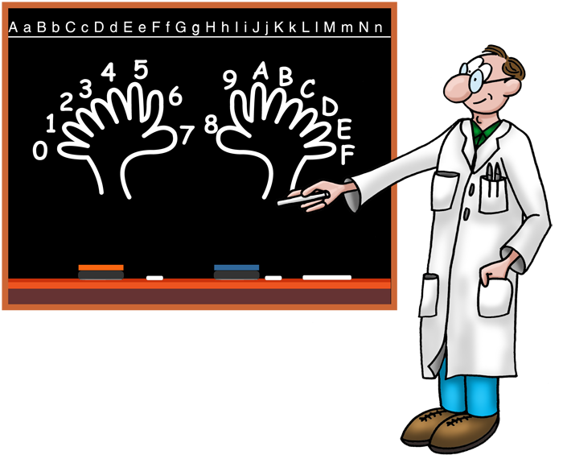
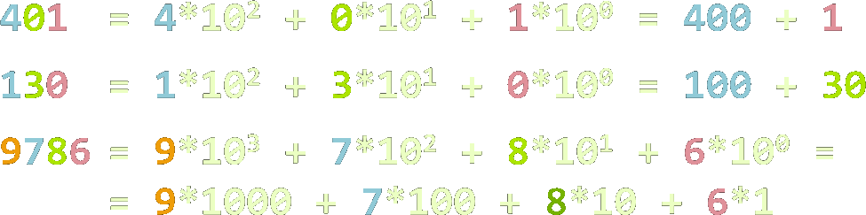
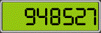
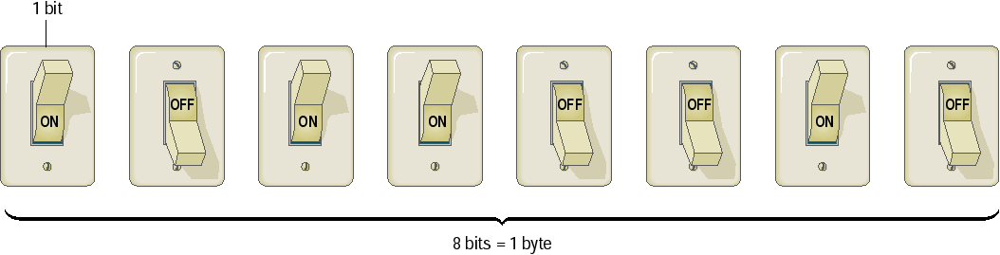
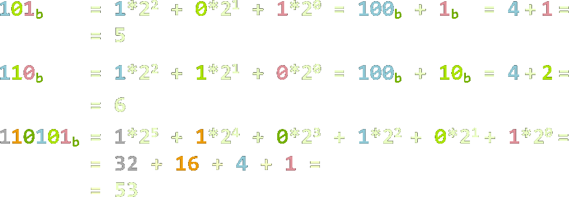
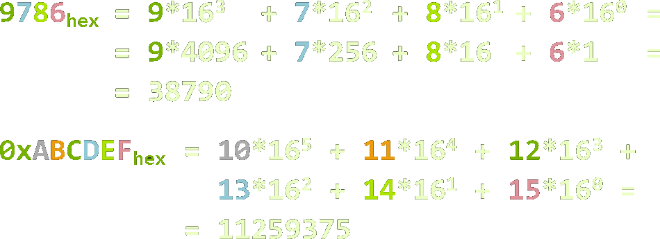
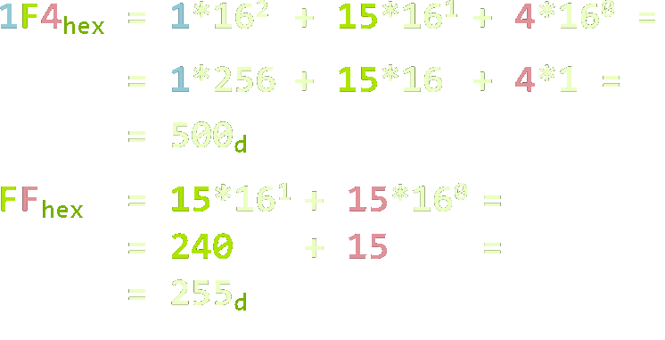
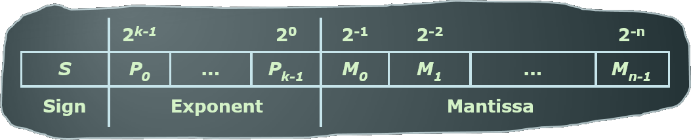
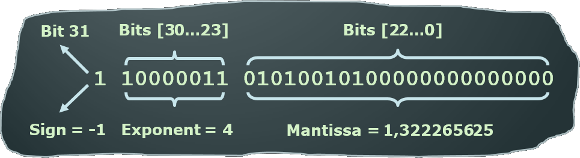

<!-- section start -->
<!-- attr: {  class:'slide-title', showInPresentation:true, hasScriptWrapper:true, style:'' } -->
# Numeral Systems
## Binary, Decimal and Hexadecimal Numbers

<!--  -->

	
C# Advanced

	
Telerik Software Academy

	<a href="https://telerikacademy.com" class="signature-link">https://telerikacademy.com</a>

<!-- section start -->
<!-- attr: {  showInPresentation:true, hasScriptWrapper:true, style:'' } -->
# Table of Contents
- [Numeral Systems](#numerals)
  - [Binary and Decimal Numbers](#binarydecimal)
  - [Hexadecimal Numbers](#hexadecimal)
  - [Conversion between Numeral Systems](#conversions)
- [Representation of Numbers](#representation)
  - [Positive and Negative Integer Numbers](#positivenegative)
  - [Floating-Point Numbers](#floats)
- [Text Representation](#textrepresentation)

<!--  -->

<!-- section start -->
<!-- attr: { id:'numerals', class:'slide-section', showInPresentation:true, hasScriptWrapper:true, style:'' } -->
#  Numeral Systems
<!-- ## Conversion between Numeral Systems -->
<!--  -->
<!--  -->

<!-- attr: { showInPresentation:true, hasScriptWrapper:true, style:'font-size: 42px' } -->
<!-- # Decimal Numbers -->
- Decimal numbers (base 10)
  - Represented using 10 numerals: `0`, `1`, `2`, `3`, `4`, `5`, `6`, `7`, `8`, `9`
- Each position represents a power of 10:

<!--  -->
<!--  -->

<!-- attr: { id:'binarydecimal', showInPresentation:true, hasScriptWrapper:true, style:'' } -->
#  Binary Numeral System
- Binary numbers are represented by sequence of bits (smallest unit of information – 0 or 1)
  - Bits are easy to represent in electronics

<!--  -->

<!-- attr: {  showInPresentation:true, hasScriptWrapper:true, style:'' } -->
# Binary Numbers
- Binary numbers (base 2)
  - Represented by 2 numerals:  `0` and `1`
- Each position represents a power of 2:

  <!--  -->

<!-- attr: {  showInPresentation:true, hasScriptWrapper:true, style:'' } -->
# Binary to Decimal Conversion
- Multiply each numeral by its exponent:

<!--  -->

<!-- attr: {  showInPresentation:true, hasScriptWrapper:true, style:'font-size: 42px' } -->
# Decimal to Binary Conversion
- Divide by 2 and append the reminders in reversed order:
- 500/2  = 250 (0)
- 250/2  = 125 (0)
- 125/2  = 62  (1)
-  62/2  = 31  (0)
-  31/2  = 15  (1)
-  15/2  = 7   (1)
-   7/2  = 3   (1)
-   3/2  = 1   (1)
-   1/2  = 0   (1)

500d = 111110100b

<!-- attr: { id:'hexadecimal',  showInPresentation:true, hasScriptWrapper:true, style:'font-size: 42px' } -->
#   Hexadecimal Numbers
- Hexadecimal numbers (base 16)
  - Represented using 16 numerals: `0`, `1`, `2`, ... `9`, `A`, `B`, `C`, `D`, `E` and `F`
- Usually prefixed with `0x`

| **Hex digits value** |               |              |               |
|:--------------------:|:-------------:|:------------:|:-------------:|
| 0 &rarr; 0x0         | 8 &rarr; 0x8  | 4 &rarr; 0x4 | 12 &rarr; 0xC |
| 1 &rarr; 0x1         | 9 &rarr; 0x9  | 5 &rarr; 0x5 | 13 &rarr; 0xD |
| 2 &rarr; 0x2         | 10 &rarr; 0xA | 6 &rarr; 0x6 | 14 &rarr; 0xE |
| 3 &rarr; 0x3         | 11 &rarr; 0xB | 7 &rarr; 0x7 | 15 &rarr; 0xF |

<!-- attr: {  showInPresentation:true, hasScriptWrapper:true, style:'' } -->
# Hexadecimal Numbers
- Each position represents a power of 16:

  <!--  -->

<!-- attr: { id:'conversions',  showInPresentation:true, hasScriptWrapper:true, style:'font-size: 42px' } -->
#   Hexadecimal to Decimal Conversion
- Multiply each digit by its exponent

<!--  -->

<!-- attr: {  showInPresentation:true, hasScriptWrapper:true, style:'' } -->
# Decimal to Hexadecimal Conversion
- Divide by 16 and append the reminders in reversed order
- 500/16 = 31 (4) 	
- 31/16  = 1 (F)
- 1/16   = 0 (1) 	

500d = 1F4hex

<!-- attr: {  showInPresentation:true, hasScriptWrapper:true, style:'font-size: 40px' } -->
# Binary to Hexadecimal (and reverse) Conversion
- The conversion from binary to hexadecimal (and back) is straightforward: each hex digit corresponds to a sequence of 4 binary digits:

| **0 - 3** | **4 - 7** | **8 - B** | **C - F** |
|:--------:|:--------:|:--------:|:--------:|
|0x0 = 0000|0x4 = 0100|0x8 = 1000|0xC = 1100|
|0x1 = 0001|0x5 = 0101|0x9 = 1001|0xD = 1101|
|0x2 = 0010|0x6 = 0110|0xA = 1010|0xE = 1110|
|0x3 = 0011|0x7 = 0111|0xB = 1011|0xF = 1111|

<!-- section start -->
<!-- attr: {  class:'slide-section', showInPresentation:true, hasScriptWrapper:true, style:'' } -->
<!-- # Numbers Representation
## Positive and Negative Integers and Floating-Point Numbers -->

<!-- attr: { id:'representation', showInPresentation:true, hasScriptWrapper:true, style:'' } -->
#  Representation of Integers
- A `short` is represented by 16 bits
  - 100	= **2**`6` + **2**`5` + **2**`2` = 00000000 01100100
- An `int` is represented by 32 bits  
  - 65545 = **2**`16` + **2**`3` + **2**`0` = 00000000 00000001 00000000 00001001
- A `char` is represented by 16 bits
  - '0'	= 48 = **2**`5` + **2**`4` =	= 00000000 00110000

<!-- attr: { id:'positivenegative',  showInPresentation:true, hasScriptWrapper:true, style:'' } -->
  
# Positive and Negative Numbers
- A number's sign is determined by the`Most Significant Bit` (MSB)
  - Only in signed integers: `sbyte`, `short`, `int`, `long`
  - Leading `0` means positive number
    - Leading `1` means negative number
  - _Example_: (8 bit numbers)
    - `0XXXXXXX`b > 0	e.g. 00010010b = 18
    - `00000000`b = 0
    - `1XXXXXXX`b < 0	e.g. 10010010b = -110

<!-- attr: {  showInPresentation:true, hasScriptWrapper:true, style:'' } -->
# Positive and Negative Numbers
- The largest positive 8-bit `sbyte` number:
  - **127** = (**2**`7` - 1) = 01111111b
- The smallest negative 8-bit number:
  - **-128** = (**-2**`7`) = 10000000b
- The largest positive 32-bit `int` number:
  - **2 147 483 647** (**2**`31` - 1) = 01111…11111b
- The smallest negative 32-bit number:
  - **-2 147 483 648** (**-2**`31`) = 10000…00000b

<!-- attr: {  showInPresentation:true, hasScriptWrapper:true, style:'font-size: 40px' } -->
# Representation of 8-bit Numbers
- Positive 8-bit numbers have the format <!-- .element: class="" style="width: 70%" --> **0** XXXXXXX
  - Their value is the decimal of their last 7 bits (XXXXXXX)
- Negative 8-bit numbers have the format <!-- .element: class="" style="width: 70%" --> **1** YYYYYYY
  - Their value is 128 (27) minus (-) the decimal of YYYYYYY
  - 10010010b = 27 – 10010b = 128 - 18 = -110

<!--  -->

<!-- attr: { id:'floats',  showInPresentation:true, hasScriptWrapper:true, style:'font-size: 42px' } -->
#   Floating-Point Numbers
- Floating-point numbers representation (according to the IEEE 754 standard*):
 
 
 
 
<!--  -->

- Example: `-21.15625` -> **sign \* 2exponent \* mantissa**

<!--  -->

<!-- section start -->
<!-- attr: {  class:'slide-section', showInPresentation:true, hasScriptWrapper:true, style:'' } -->
<!-- # Text Representation in Computer Systems -->
<!--  -->

<!-- attr: { id:'textrepresentation', showInPresentation:true, hasScriptWrapper:true, style:'' } -->
#  How Computers Represent Text Data?
- `Text encoding` is a system that uses binary numbers (1 and 0) to represent characters
  -  Letters, numerals, symbols etc.
- In the `ASCII` encoding each character consists of 8 bits (one byte) of data
  - ASCII is used in nearly all personal computers
- In the `Unicode` (`UTF-16`) encoding each character consists of 16 bits (two bytes)
  - Can represent many alphabets

<!-- attr: {  showInPresentation:true, hasScriptWrapper:true, style:'font-size: 40px' } -->
# Character Codes – ASCII Table

| Binary code | Decimal code | Character |
|:-----------:|:------------:|:---------:|
| `01000001`  | `65`         | `A`       |
| `01000010`  | `66`         | `B`       |
| `01000011`  | `67`         | `C`       |
| `01000100`  | `68`         | `D`       |
| `00100011`  | `35`         | `#`       |
| `01100000`  | `48`         | `0`       |
| `00110001`  | `49`         | `1`       |
| `01111110`  |`126`         | `~`       |

<!-- attr: {  showInPresentation:true, hasScriptWrapper:true, style:'' } -->
# Strings of Characters
- Strings are sequences of characters
  - Null-terminated (like in C)
   
   
   

  - Represented by array
   
   
   

- Characters in the strings can be:
  - `8 bit` (`ASCII` / `windows-1251` / …)
  - `16 bit` (`UTF-16`)

<!--  -->
<!--  -->

  <!-- attr: { class:'slide-section', showInPresentation: true, hasScriptWrapper: true, style:'font-size: 42px' } -->
  <!-- # C# Numeral Systems
  ## Questions? -->

  <!-- attr: { showInPresentation: true, hasScriptWrapper: true} -->
  # Free Training @ Telerik Academy

  - Fundamentals of C# Programming Track of Courses
      - [csharpadvanced](http://academy.telerik.com/student-courses/programming/csharp-programming-part-2/about)
    - Telerik Software Academy
      - [telerikacademy.com](https://telerikacademy.com)
    - Telerik Academy @ Facebook
      - [facebook.com/TelerikAcademy](https://facebook.com/TelerikAcademy)
    - Telerik Academy Learning System
      - [telerikacademy.com](https://telerikacademy.com)
