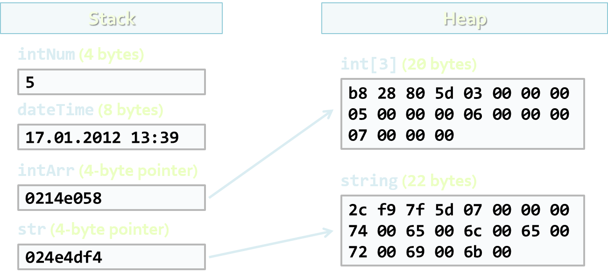

<!-- section start -->
<!-- attr: { class:'slide-title', showInPresentation:true, hasScriptWrapper:true } -->
# Using Classes and Objects
## Using the Standard .NET Framework Classes


<!--  -->
<!--  -->
<div class="signature">
	<p class="signature-course">C# Advanced</p>
	<p class="signature-initiative">Telerik Software Academy</p>
	<a href="https://telerikacademy.com" class="signature-link">https://telerikacademy.com</a>
</div>


<!-- section start -->
<!-- attr: { showInPresentation:true, hasScriptWrapper:true } -->
# Table of Contents
- Classes and Objects
  - [What are Objects?](#objects)
  - [What are Classes?](#classes)
- [Classes in C#](#csharpclasses)
  - [Declaring an object](#objectdeclaration)
  - [Fields and Properties: Instance and Static](#fields)
  - [Instance and Static Methods](#instancestatic)
  - [Constructors](#constructor)
- [Enumerations](#enumeration)

<!--  -->


<!-- attr: { showInPresentation:true, hasScriptWrapper:true } -->
<!-- # Table of Contents -->
- [Structures](#structure)
- [Namespaces](#namespace)
- [**Random** class](#random)
- [Introduction to .NET Common Type System](#cts)

<!--  -->


<!-- section start -->
<!-- attr: { class:'slide-section', showInPresentation:true, hasScriptWrapper:true } -->
<!-- Classes and Objects
## Modeling Real-world Entities with Objects -->


<!-- attr: { id:'objects', class:'', showInPresentation:true, hasScriptWrapper:true } -->
# <a id="objects"></a>What are Objects?
- Software objects model real-world objects or abstract concepts
  - _Examples_:
    - bank, account, customer, dog, bicycle, queue
- Real-world objects have **states** and **behaviors**
  - Account' states:
    - holder, balance, type
  - Account' behaviors:
    - withdraw, deposit, suspend


<!-- attr: { showInPresentation:true, hasScriptWrapper:true } -->
<!-- # What are Objects? -->
- How do software objects implement real-world objects?
  - Use **variables**/**data** to implement states
  - Use **methods**/**functions** to implement behaviors
- An object is a software bundle of variables and related methods

<!--  -->


<!-- attr: { showInPresentation:true, hasScriptWrapper:true } -->
# Objects Represent
- Things from the real world
    - **&#10004;** checks
    - **&#10004;** people
    - **&#10004;** shopping list
- Things from the computer world
    - **&#10004;** numbers
    - **&#10004;** characters
    - **&#10004;** queues
    - **&#10004;** arrays


<!-- attr: { id:'classes', class:'', showInPresentation:true, hasScriptWrapper:true } -->
# <a id="classes"></a>What is a Class?
- The formal definition of `class`:
- Definition by Google

    - `Classes` act as templates from which an instance of an object is created at run time. Classes define the properties of the object and the methods used to control the object's behavior.


<!-- attr: { showInPresentation:true, hasScriptWrapper:true } -->
# Classes
- Classes provide the structure for objects
  - Define their prototype, act as template
- Classes define:
  - Set of `attributes`
    - Represented by variables and properties
    - Hold their **state**
  - Set of actions (**behavior**)
    - Represented by methods
- A class defines the methods and types of data associated with an object


<!-- attr: { showInPresentation:true, hasScriptWrapper:true } -->
# Classes – _Example_

```cs
Account
```


```cs
+Owner: Person
+Ammount: double
```


```cs
+Suspend()
+Deposit(sum:double)
+Withdraw(sum:double)
```

<div class="fragment balloon" style="top:15%; left:37.97%; width:23.80%">Class Name</div>
<div class="fragment balloon" style="top:25%; left:37.97%; width:25.03%">Attributes</div>
<div class="fragment balloon" style="top:32%; left:37.97%; width:25.03%">(Properties and Fields)</div>
<div class="fragment balloon" style="top:45%; left:37.97%; width:24.85%">Operations</div>
<div class="fragment balloon" style="top:52%; left:37.97%; width:24.85%">(Methods)</div>


<!-- attr: { showInPresentation:true, hasScriptWrapper:true } -->
# Objects
- An `object` is a concrete `instance` of a particular class
- Creating an object from a class is called **instantiation**
- Objects have state
  - Set of values associated to their attributes
- _Example_:
  - Class: `Account`
  - Objects: Ivan's `account`, Peter's `account`


<!-- attr: { showInPresentation:true, hasScriptWrapper:true, style:'font-size: 1em' } -->
# Objects – _Example_

- Class

```cs
Account

+Owner: Person
+Ammount: double

+Suspend()
+Deposit(sum:double)
+Withdraw(sum:double)
```
<!-- attr: { showInPresentation:true, hasScriptWrapper:true, style:'font-size: 1em' } -->
# Objects – _Example_
- Objects

```cs
ivanAccount

+Owner="Ivan Kolev"
+Ammount=5000.0
```

```cs
peterAccount

+Owner="Peter Kirov"
+Ammount=1825.33
```


<!-- section start -->
<!-- attr: { class:'slide-section', showInPresentation:true, hasScriptWrapper:true } -->
<!-- # Classes in C&#35; -->


<!-- attr: { id:'csharpclasses', showInPresentation:true, hasScriptWrapper:true } -->
# <a id="csharpclasses"></a>Classes in C&#35;
- `Classes` – basic units that compose programs
- Implementation is **encapsulated** (hidden)
- `Classes` in C# can contain:
  - Fields (member variables)
  - Properties
  - Methods
  - Constructors
  - Inner types
  - Etc. (events, indexers, operators, …)

<!--  -->


<!-- attr: { showInPresentation:true, hasScriptWrapper:true } -->
# Classes in C# – _Examples_
- _Example_ of `classes` (structures):
  - `System.Console`
  - `System.String` (`string` in C#)
  - `System.Int32` (`int` in C#)
  - `System.Array`
  - `System.Math`
  - `System.Random`
  - `System.Collections.Generics.List<T>`


<!-- attr: { id:'objectdeclaration', class:'', showInPresentation:true, hasScriptWrapper:true } -->
# <a id="objectdeclaration"></a>Declaring Objects
- An instance of a class or structure can be defined like any other variable:

```cs
using System;
...
// Define two variables of type DateTime
DateTime today;
DateTime halloween;
```

- Instances cannot be used if they are not initialized

```cs
// Declare and initialize a structure instance
DateTime today = DateTime.Now;
```


<!-- section start -->
<!-- attr: { id:'fields', class:'slide-section', showInPresentation:true, hasScriptWrapper:true } -->
<!-- # <a id="fields"></a>Fields and Properties
## Accessing Fields and Properties -->

<!--  -->


<!-- attr: { showInPresentation:true, hasScriptWrapper:true } -->
# Fields
- `Fields` are data members of a class
  - Can be variables and constants (read-only)
- Accessing a field doesn’t invoke any actions of the object
  - Just accesses its value
- _Example_:
  - `string.Empty` (the `""` string)


<!-- attr: { showInPresentation:true, hasScriptWrapper:true } -->
# Accessing Fields
- `Constant fields` can be only read
- `Variable fields` can be read and modified
- Usually properties are used instead of directly accessing variable fields
- _Examples_:

```cs
// Accessing read-only field
String empty = String.Empty;

// Accessing constant field
int maxInt = Int32.MaxValue;
```

<!--  -->


<!-- attr: { showInPresentation:true, hasScriptWrapper:true } -->
# Properties
- `Properties` look like fields
  - Have name and type
  - Can contain code, executed when accessed
- Usually used as wrappers
  - To control the access to the data fields
  - Can contain more complex logic
- Can have two components called `accessors`
  - `get` for reading their value
  - `set` for changing their value

<!--  -->


<!-- attr: { showInPresentation:true, hasScriptWrapper:true } -->
<!-- # Properties -->
- According to the implemented accessors properties can be:
  - Read-only (`get` accessor only)
  - Read and write (both `get` and `set` accessors)
  - Write-only (`set` accessor only)
- _Example_ of read-only property:
  - `String.Length`
- _Example_ of read-write property:
  - `Console.BackgroundColor`

<!--  -->


<!-- attr: { showInPresentation:true, hasScriptWrapper:true, style:'font-size: 0.9em' } -->
# Accessing Properties and Fields – _Example_

```cs
DateTime christmas = new DateTime(2009, 12, 25);

int day = christmas.Day;
int month = christmas.Month;
int year = christmas.Year;

Console.WriteLine(
  "Christmas day: {0}, month: {1}, year: {2}",
  day, month, year);

Console.WriteLine(
  "Day of year: {0}", christmas.DayOfYear);

Console.WriteLine("Is {0} leap year: {1}",
  year, DateTime.IsLeapYear(year));
```


<!-- attr: { class:'slide-section demo', showInPresentation:true, hasScriptWrapper:true } -->
<!-- # Accessing Properties and Fields
## [Demo](./../demos/PropertiesAndFields) -->

<!--  -->


<!-- section start -->
<!-- attr: { id:'instancestatic', class:'slide-section', showInPresentation:true, hasScriptWrapper:true } -->
<!-- # <a id="instancestatic"></a>Instance and Static Members
## Accessing Object and Class Members -->

<!--  -->


<!-- attr: { showInPresentation:true, hasScriptWrapper:true } -->
# Instance and Static Members
- Fields, properties and methods can be:
  - **Instance** (or object members)
  - **Static** (or class members)
- Instance members are specific for each object
  - _Example_: different dogs have different name
- Static members are common for all instances of a class
  - _Example_: `DateTime.MinValue` is shared between all instances of `DateTime`


<!-- attr: { showInPresentation:true, hasScriptWrapper:true, style:'font-size: 0.9em' } -->
# Accessing Members – Syntax
- Accessing instance members
  - The name of the **instance**, followed by the name of the member (field or property), separated by dot ("`.`")

  ```cs
  <instance_name>.<member_name>
  ```

- Accessing static members
  - The name of the **class**, followed by the name of the member

```cs
<class_name>.<member_name>
```


<!-- attr: { showInPresentation:true, hasScriptWrapper:true } -->
# Instance and Static Members – _Examples_
- _Example_ of **instance member**
  - `String.Length`
    - Each string object has a different length
    - E.g. `"I like C#".Length` &rarr; 9
- _Example_ of **static member**
  - `Console.ReadLine()`
    - The console is only one (global for the program)
    - Reading from the console does not require to create an instance of it


<!-- section start -->
<!-- attr: { class:'slide-section', showInPresentation:true, hasScriptWrapper:true } -->
<!-- # Methods
## Calling Instance and Static Methods -->


<!-- attr: { showInPresentation:true, hasScriptWrapper:true } -->
# Methods
- **Methods manipulate** the data of the object to which they belong or **perform other tasks**
- _Examples_:
  - `Console.WriteLine(someObject)`
  - `Console.ReadLine()`
  - `String.Substring(index, length)`
  - `Array.GetLength(index)`
  - `List<T>.Add(item)`
  - `DateTime.AddDays(count)`

<!--  -->


<!-- attr: { showInPresentation:true, hasScriptWrapper:true } -->
# Instance Methods
- **Instance methods** - **manipulate the data of a specified object** or **perform any other tasks**
  - If a value is returned, it depends on the particular class instance
- Syntax:
  - The name of the instance, followed by the name of the method, separated by dot

```cs
<object_name>.<method_name>(<parameters>)
```


<!-- attr: { showInPresentation:true, hasScriptWrapper:true, style:'font-size: 0.9em' } -->
# Calling Instance Methods –  _Examples_
- Calling instance methods of `String`:

```cs
String sampleLower = new String('a', 5);
String sampleUpper = sampleLower.ToUpper();

Console.WriteLine(sampleLower); // aaaaa
Console.WriteLine(sampleUpper); // AAAAA
```

- Calling instance methods of `DateTime`:

```cs
DateTime now = DateTime.Now;
DateTime later = now.AddHours(8);

Console.WriteLine("Now: {0}", now);
Console.WriteLine("8 hours later: {0}", later);
```


<!-- attr: { class:'slide-section demo', showInPresentation:true, hasScriptWrapper:true } -->
<!-- # Calling Instance Methods
## [Demo](./../demos/InstanceMethods) -->


<!-- attr: { showInPresentation:true, hasScriptWrapper:true } -->
# Static Methods
- **Static methods** are **common for all instances of a class** (shared between all instances)
  - Returned value depends only on the passed parameters
  - No particular class instance is available
- Syntax:
  - The name of the class, followed by the name of the method, separated by dot

```cs
<class_name>.<method_name>(<parameters>)
```


<!-- attr: { showInPresentation:true, hasScriptWrapper:true } -->
# Calling Static Methods – _Examples_

```cs
using System;

double radius = 2.9;
double area = Math.PI * Math.Pow(radius, 2);
Console.WriteLine("Area: {0}", area);
// Area: 26,4207942166902

double precise = 8.7654321;
double round3 = Math.Round(precise, 3);
double round1 = Math.Round(precise, 1);
Console.WriteLine(
    "{0}; {1}; {2}", precise, round3, round1);
// 8,7654321; 8,765; 8,8
```


<!-- attr: { class:'slide-section demo', showInPresentation:true, hasScriptWrapper:true } -->
<!-- # Calling Static Methods
## [Demo](./../demos/StaticMethods) -->

<!-- attr: { id:'constructor', class:'', showInPresentation:true, hasScriptWrapper:true } -->
# <a id="constructor"></a>Constructors
- `Constructors` are special methods used to **assign initial values of the fields** in an object
  - Executed when an object of a given type is being created
  - Have the same name as the class that holds them
  - Do not return a value
- A class may have **several constructors** with different set of parameters


<!-- attr: { showInPresentation:true, hasScriptWrapper:true, style:'font-size: 0.9em' } -->
<!-- # Constructors -->
- Constructor is invoked by the `new` operator

```cs
<instance_name> = new <class_name>(<parameters>)
```

- _Examples_:

```cs
String s = new String(new char[]{'a','b','c'});
```


```cs
String s = new String('*', 5); // s = "*****"
```


```cs
DateTime dt = new DateTime(2009, 12, 30);
```


```cs
DateTime dt = new DateTime(2009, 12, 30, 12, 33, 59);
```


```cs
Int32 value = new Int32();
```


<!-- attr: { showInPresentation:true, hasScriptWrapper:true } -->
# Parameterless Constructors
- The constructor without parameters is called **default**(**parameterless**) constructor
- _Example_:
  - Creating an object for generating random numbers with a default seed

```cs
// parameterless constructor Random() invoked
Random randomGenerator = new Random();
```


<!-- attr: { showInPresentation:true, hasScriptWrapper:true } -->
# Constructor with Parameters
- _Example_
  - Creating objects for generating random values with specified initial seeds

```cs
using System;
...
Random randomGenerator1 = new Random(123);
Console.WriteLine(randomGenerator1.Next());
// 2114319875

Random randomGenerator2 = new Random(456);
Console.WriteLine(randomGenerator2.Next(50));
// 47
```


<!-- attr: { class:'slide-section demo', showInPresentation:true, hasScriptWrapper:true } -->
<!-- # Generating Random Numbers
## [Demo](./../demos/RandomNumbers) -->

<!-- attr: { showInPresentation:true, hasScriptWrapper:true } -->
# More Constructor _Examples_
- Creating a `DateTime` object for a specified date and time

```cs
using System;

DateTime halloween = new DateTime(2009, 10, 31);
Console.WriteLine(halloween);

DateTime julyMorning =
  new DateTime(2009, 7, 1, 5, 52, 0);
Console.WriteLine(julyMorning);
```

- Different constructors are called depending on the different sets of parameters

<!-- attr: { class:'slide-section demo', showInPresentation:true, hasScriptWrapper:true } -->
<!-- # Creating DateTime Objects
## [Demo](./../demos/DateTimeCreating) -->

<!--  -->


<!-- section start -->
<!-- attr: { class:'slide-section', showInPresentation:true, hasScriptWrapper:true } -->
<!-- # Enumerations
## Types Limited to a Predefined Set of Values -->

<!--  -->


<!-- attr: { id:'enumeration', showInPresentation:true, hasScriptWrapper:true } -->
# <a id="enumeration"></a>Enumerations
- `Enumerations` in C# are types whose values are **limited to a predefined set of values**
  - E.g. the days of week
  - Declared by the keyword `enum` in C#
  - Hold values from a predefined set

```cs
public enum Color { Red, Green, Blue, Black }
…
Color color = Color.Red;
Console.WriteLine(color); // Red
color = 5; // Compilation error!
```


<!-- attr: { class:'slide-section demo', showInPresentation:true, hasScriptWrapper:true } -->
<!-- # Enumerations
## [Demo](./../demos/Enumerations) -->

<!--  -->
<!--  -->

<!-- section start -->
<!-- attr: { class:'slide-section', showInPresentation:true, hasScriptWrapper:true } -->
<!-- # Structures
## What are Structures? When to Use Them? -->

<!-- attr: { id:'structure', showInPresentation:true, hasScriptWrapper:true, style:'font-size: 0.9em' } -->
# <a id="structure"></a>Structures
- `Structures` in C# are **similar to classes**
  - Structures are **value types** (directly hold a value)
  - Classes are reference types (pointers)
- Structures are usually used for storing data structures, without any other functionality
- Structures can have fields, properties, etc.
  - Using methods is not recommended
- _Example_ of structure
  - `System.DateTime` – represents a date and time


<!-- section start -->
<!-- attr: { class:'slide-section', showInPresentation:true, hasScriptWrapper:true } -->
<!-- # Namespaces
## Organizing Classes Logically into Namespaces -->

<!-- attr: { id:'namespace', showInPresentation:true, hasScriptWrapper:true } -->
# <a id="namespace"></a>What is a Namespace?
- `Namespaces` are used to **organize the source code** into more logical and manageable way
- Namespaces can contain
  - Definitions of classes, structures, interfaces and other types and other namespaces
- Namespaces can contain other namespaces
- For example:
  - `System` namespace contains `Data` namespace
  - The name of the nested namespace is `System.Data`


<!-- attr: { showInPresentation:true, hasScriptWrapper:true } -->
# Full Class Names
- A **full name of a class** is the name of the class preceded by the name of its namespace

```cs
<namespace_name>.<class_name>
```

- _Example_:
  - `Array` class, defined in the `System` namespace
  - The full name of the class is `System.Array`


<!-- attr: { showInPresentation:true, hasScriptWrapper:true, style:'font-size: 0.9em' } -->
# Including Namespaces
- The `using` directive in C#:

```cs
using <namespace_name>
```

- **Allows using types in a namespace**, without specifying their full name
- 	_Example_:

```cs
using System;
DateTime date;
```

- 	instead of

```cs
System.DateTime date;
```


<!-- section start -->
<!-- attr: { id:'random', class:'slide-section', showInPresentation:true, hasScriptWrapper:true } -->
<!-- # <a id="random"></a>The `Random` Class
## Password Generator Demo -->

<!--  -->
<!--  -->


<!-- attr: { showInPresentation:true, hasScriptWrapper:true } -->
# The `Random` Class
- The `Random` class
  - Generates random integer numbers

```cs
Random rand = new Random();
for (int number = 1; number <= 6; number++)
{
   int randomNumber = rand.Next(49) + 1;
   Console.Write("{0} ", randomNumber);
}
```

- This generates 6 random int in range [1..49]
- Always use a single `Random` instance!
  - This will avoid abnormalities


<!-- attr: { showInPresentation:true, hasScriptWrapper:true } -->
# Password Generator – _Example_
- Write a program to generate a **random password** between 8 and 15 characters
  - The password contains of at least two capital letters, two small letters, one digit and  three special characters
- Constructing the password generator class:
  - Start from an empty password
  - Place 2 random capital letters at random positions
  - Place 2 random small letters at random positions
  - Place 1 random digit at random positions
  - Place 3 special characters at random positions


<!-- attr: { showInPresentation:true, hasScriptWrapper:true } -->
<!-- # Password Generator -->
- Now we have exactly 8 characters
  - To make the password length between 8 and 15 we add between 0 and 7 random characters
    - Capital / small letters / digits / special character
    - Inserts each of them at random position

<!--  -->


<!-- attr: { showInPresentation:true, hasScriptWrapper:true } -->
# Password Generator Class

```cs
class RandomPasswordGenerator
{
   private const string CapitalLetters=
    "ABCDEFGHIJKLMNOPQRSTUVWXYZ";
   private const string SmallLetters =
    "abcdefghijklmnopqrstuvwxyz";
   private const string Digits = "0123456789";
   private const string SpecialChars =
    "~!@#$%^&*()_+=**{}[]\\|':;.,/?<>";
   private const string AllChars =
    CapitalLetters + SmallLetters + Digits + SpecialChars;
  	 private static Random rnd = new Random();

 // the example continues…
```


<!-- attr: { showInPresentation:true, hasScriptWrapper:true, style:'font-size: 40px;' } -->
<!-- # Password Generator Class -->

```cs
static void Main()
{
   StringBuilder password = new StringBuilder();
   for (int i = 1; i <= 2; i++)
   {
      char capitalLetter = GenerateChar(CapitalLetters);
      InsertAtRandomPosition(password, capitalLetter);
   }
   for (int i = 1; i <= 2; i++)
   {
      char smallLetter = GenerateChar(SmallLetters);
      InsertAtRandomPosition(password, smallLetter);
   }
   char digit = GenerateChar(Digits);
   InsertAtRandomPosition(password, digit);
   for (int i = 1; i <= 3; i++)
   {
      char specialChar = GenerateChar(SpecialChars);
      InsertAtRandomPosition(password, specialChar);
   } 
// the example continues…
```


<!-- attr: { showInPresentation:true, hasScriptWrapper:true, style:'font-size: 40px;' } -->
<!-- # Password Generator Class -->

```cs
   int count = rnd.Next(8);
   for (int i = 1; i <= count; i++)
   {
      char specialChar = GenerateChar(AllChars);
      InsertAtRandomPosition(password, specialChar);
   } 
   Console.WriteLine(password);
}
private static void InsertAtRandomPosition(
   StringBuilder password, char character)
{
   int randomPosition = rnd.Next(password.Length + 1);
   password.Insert(randomPosition, character);
}
private static char GenerateChar(string availableChars)
{
   int randomIndex = rnd.Next(availableChars.Length);
   char randomChar = availableChars[randomIndex];
   return randomChar;
}
```

<!-- section start -->
<!-- attr: { class:'slide-section', showInPresentation:true, hasScriptWrapper:true } -->
<!-- # .NET Common Type System
## Brief Introduction -->


<!-- attr: { id:'cts', showInPresentation:true, hasScriptWrapper:true } -->
# <a id="cts"></a>Common Type System (CTS)
- `CTS` defines all **data types** supported in .NET Framework
  - Primitive types (e.g. `int`, `float`, `object`)
  - Classes (e.g. `String`, `Console`, `Array`)
  - Structures (e.g. `DateTime`)
  - Arrays (e.g. `int[]`, `string[,]`)
  - Etc.
- Object-oriented by design


<!-- attr: { showInPresentation:true, hasScriptWrapper:true, style:'font-size: 40px;' } -->
# CTS and Different Languages
- `CTS` is common for all .NET languages
  - C#, F#, VB.NET, J#, JScript.NET, ...
- `CTS` type mappings:

| `CTS Type`       | `C# Type` | `VB.NET Type` |
|:---------------|:--------|:------------|
| System.Int32   | int     | Integer     |
| System.Single  | float   | Single      |
| System.Boolean | bool    | Boolean     |
| System.String  | string  | String      |
| System.Object  | object  | Object      |


<!-- attr: { showInPresentation:true, hasScriptWrapper:true, style:'font-size: 0.9em' } -->
# System.Object: CTS Base Type
- `System.Object` (`object` in C#) is a base type for all other types in `CTS`
  - Can hold values of any other type:

```cs
string s = "test";
object obj = s;
```

- All .NET types derive common methods from `System.Object`, e.g. `ToString()`

```cs
DateTime now = DateTime.Now;
string nowInWords = now.ToString();
Console.WriteLine(nowInWords);
```


<!-- attr: { showInPresentation:true, hasScriptWrapper:true, style:'font-size: 40px;' } -->
# Value and Reference Types
- In CTS there are two categories of types
  - **Value** **types**
  - **Reference types**
- Placed in different areas of memory
  - Value types live in the **execution stack***
    - Freed when become out of scope
  - Reference types live in the **managed heap**(dynamic memory)
    - Freed by the **garbage collector**
- _Note_: this does not mean that value types, which are part of reference types live on the stack. E.g., integers in a `List<int>` do not live on the stack


<!-- attr: { showInPresentation:true, hasScriptWrapper:true } -->
# Value and Reference Types – _Examples_
- **Value** types
  - Most of the primitive types
  - Structures
  - _Examples_: `int`, `float`, `bool`, `DateTime`
- **Reference** types
  - Classes and interfaces
  - Strings
  - Arrays
  - _Examples_: `string`, `Random`, `object`, `int[]`


<!-- attr: { showInPresentation:true, hasScriptWrapper:true } -->
# Value and Reference Types

```cs
int intNum = 5;
DateTime date = DateTime.Now;
int[] intArr = new int[] {5, 6, 7};
string str = "telerik";
```



<!-- attr: { showInPresentation:true, hasScriptWrapper:true } -->
# Summary
- `Classes` provide the **template** for objects
- `Objects` are particular **instances of classes**
- `Classes` have **different members**
  - Methods, fields, properties, etc.
  - Instance and static members
  - Members can be accessed
  - Methods can be called
- `Structures` are used for **storing data**
- Namespaces group related classes


<!-- attr: { showInPresentation:true, hasScriptWrapper:true } -->
<!-- # Summary -->
- Namespaces help organizing the classes
- **Common Type System** (CTS) defines the types for all .NET languages
  - **Value** types
  - **Reference** types


<!-- attr: { class:'slide-section', showInPresentation:true, hasScriptWrapper:true } -->
<!-- # Using Classes and Objects
## Questions?-->


<!-- attr: { showInPresentation:true, hasScriptWrapper:true } -->
# Free Trainings @ Telerik Academy
- “C# Programming @ Telerik Academy
    - [csharpadvanced](http://academy.telerik.com/student-courses/programming/csharp-programming-part-2/about)
  - Telerik Software Academy
    - [https://telerikacademy.com](https://telerikacademy.com)
  - Telerik Academy @ Facebook
    - [http://facebook.com/TelerikAcademy](facebook.com/TelerikAcademy)
  - Telerik Software Academy Forums
    - [http://telerikacademy.com/Forum/Home](http://telerikacademy.com/Forum/Home)


<!--  -->
