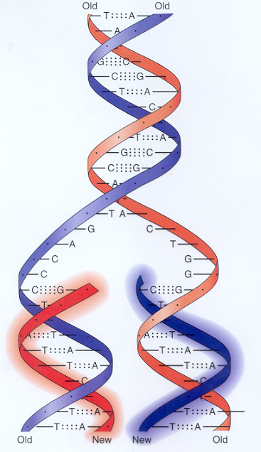
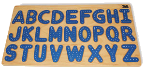
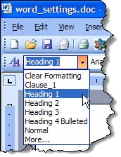

<!-- section start -->
<!-- attr: { id:'', class:'slide-title', showInPresentation:true, hasScriptWrapper:true, style:'' } -->
# Strings and Text Processing
## Processing and Manipulating Text Information

<div class="signature">
  <p class="signature-course">C# Advanced</p>
  <p class="signature-initiative">Telerik Software Academy</p>
  <a href="https://telerikacademy.com" class="signature-link">https://telerikacademy.com</a>
</div>

<!--  -->
<!--  -->
<!--  -->
<!--  -->

<!-- section start -->

# Table of Contents
- What is String?
- Creating and Using Strings
  - Declaring, Creating, Reading and Printing
- Manipulating Strings
  - Comparing, Concatenating, Searching, Extracting Substrings, Splitting
- Other String Operations
  - Replacing Substrings, Deleting Substrings, Changing Character Casing, Trimming

<!-- attr: {showInPresentation: true} -->
<!-- # Table of Contents -->

- Building and Modifying Strings
  - Why the `+` Operator is Slow?
  - Using the `StringBuilder` Class
- Formatting Strings
  - Formatting Numbers, Dates and Currency
- Cultures and Culture-Sensitive Formatting
  - Accessing and Assigning the Current Culture
  - Parsing Numbers and Dates

<!-- section start -->

<!-- attr: {class:'slide-section', showInPresentation: true} -->
<!-- # What Is String?
##  Sequences of Characters -->

<!--  -->

# What Is String?
- Strings are sequences of characters
- Each character is a Unicode symbol
- Represented by the `string` data type in C# (`System.String`)
- _Example_:

```cs
string s = "Hello, C#";
```
| 0 | 1 | 2 | 3 | 4 | 5 | 6 | 7 | 8 |
|:--|:--|:--|:--|:--|:--|:--|:--|:--|
| H | e | l | l | o | , |   | C | # |

<!--  -->

# The `System.String` Class
- Strings are represented by `System.String` objects in .NET Framework
  - String objects contain an **immutable** (read-only) sequence of characters
  - Strings use **Unicode** to support multiple languages and alphabets
- Strings are stored in the dynamic memory (**managed heap**)
- `System.String` is reference type

<!-- attr: {showInPresentation: true} -->
<!-- # The `System.String` Class -->

- String objects are like arrays of characters (`char[]`)
  - Have fixed length (`String.Length`)
  - Elements can be accessed directly by index
    - The index is in the range `[0...Length-1]`

```cs
string s = "Hello!";
int len = s.Length; // len = 6char ch = s[1]; // ch = 'e'
```

| index      | 0 | 1 | 2 | 3 | 4 | 5 |
|:-----------|:--|:--|:--|:--|:--|:--|
| str[index] | H | e | l | l | o | ! |

<!--  -->

<!-- attr: { showInPresentation: true} -->
<!-- # Strings: Examples -->

-  _Example_: Printing the characters of a string with a `for` loop

```cs
static void Main()
{
  string greeting = "Stand up, stand up, Balkan Superman.";
  Console.WriteLine("greeting = \"{0}\"", greeting);
  Console.WriteLine("greeting.Length = {0}", greeting.Length);

  for (int i = 0; i < greeting.Length; i++)
  {
    Console.WriteLine("greeting[{0}] = {1}", i, greeting[i]);
  }
}
```

<!--  -->

<!-- attr: { class: 'slide-section', showInPresentation: true} -->
<!-- # Printing the Characters of a String -->
## [Demo]()
<!--  -->

# Declaring Strings
- Several ways of declaring string variables:
  - Using the C# keyword `string`
  - Using the .NET's fully qualified class name `System.String`

  ```cs
  string str1;
  System.String str2;
  String str3;
  ```

  - The above three declarations are equivalent

<!--  -->

# Creating Strings

- Before initializing a string variable has `null` value
- Strings can be initialized by:
  - Assigning a string literal to the string variable
  - Assigning the value of another string variable
  - Assigning the result of operation of type string

<!--  -->

<!-- attr: {showInPresentation: true, style: 'font-size:0.8em'} -->
# Creating Strings

- **Uninitialized** variables has value of `null`
  -  When their are local variables, they cannot be used

```cs
string s; // s is equal to null
```

- Assigning with **string literal**

```cs
string s = "I am a string literal!";
```

- Assigning from **another string** variable

```cs
string s2 = s;
```

- Assigning from the **result of string operation**

```cs
string s = 42.ToString();
```

# Reading and Printing Strings

- Reading strings from the console
  - Use the method `Console.ReadLine()`

```cs
string s = Console.ReadLine();
```

- Printing strings to the console
  - Use the methods `Write()` and `WriteLine()`

```cs
Console.Write("Please enter your name: ");
string name = Console.ReadLine();
Console.Write("Hello, {0}! ", name);
Console.WriteLine("Welcome to our party!");
```

<!-- attr: {class: 'slide-section', showInPresentation: true} -->
<!-- #  Reading and Printing Strings -->
## [Demo]()
<!--  -->

<!-- section start -->

<!-- attr: {class: 'slide-section', showInPresentation: true} -->
<!-- # Manipulating Strings
## Comparing, Concatenating, Searching, Extracting Substrings, Splitting -->

<!--  -->
<!--  -->

<!-- attr: {style: 'font-size: 0.75em; line-height: 0.75em'} -->
# Comparing Strings

- Several ways to compare two strings:
  - Dictionary-based string comparison
  - **Case-insensitive**

    ```cs
    int result = string.Compare(str1, str2, true);
    ```

  - **Case-sensitive**

    ```cs
    string.Compare(str1, str2, false);
    ```

| Result | When                                     |
| ------ | ---------------------------------------- |
| 0      | str1 is equal to str2                    |
| < 0    | str1 is is before str2 lexicographically |   
| > 0    | str1 is is after str2 lexicographically  |   

<!-- attr: { showInPresentation: true} -->
<!-- # Comparing Strings -->

- Equality checking by operator **==**
  -  Always returns `true` or `false`
  - Performs case-sensitive compare

```cs
bool areStringsEqual = (str1 == str2);
```

- Using the case-sensitive **Equals()** method
  - The same effect like the operator **==**

```cs
bool areStringsEqual = str1.Equals(str2));
```

<!-- attr: {showInPresentation: true} -->
<!-- # Comparing Strings: _Example_ -->

- Finding the first string in a **lexicographical order** from a given list of strings:

```cs
string[] towns = {"Sofia", "Varna", "Burgas", "Plovdiv", "Pleven",  "Rousse", "Yambol"};
string bestTown = towns[0];

foreach (string town in towns)
{
   if (String.Compare(town, bestTown) < 0)
   {
      bestTown = town;
   }
}

Console.WriteLine("First town: {0}", bestTown);
```

<!-- attr: {class: 'slide-section', showInPresentation: true} -->
<!-- #  Comparing Strings -->
## [Demo]()
<!--  -->

<!-- attr: {style: 'font-size: 0.85em'} -->
# Concatenating Strings

- There are two ways to combine strings:
  - Using the `Concat()` method

```cs
string str = String.Concat(str1, str2);
```

  - Using the `+` or the `+=` operators

```cs
string str = str1 + str2 + str3;
string str += str1;
```

- Any object can be appended to a `string`

```cs
string name = "Peter";
int age = 22;
string s = name + " " + age; // &rarr; "Peter 22"
```

<!-- attr: {showInPresentation: true} -->
<!-- # Concatenating Strings: _Example_ -->

-  _Example:_ concatenating strings

```cs
string firstName = "Telerik";
string lastName = "Academy";

string fullName = firstName + " " + lastName;
Console.WriteLine(fullName);
// Telerik Academy

int age = 5;

string nameAndAge = "Name: " + fullName + "\nAge: " + age;
Console.WriteLine(nameAndAge);
// Name: Telerik Academy
// Age: 5
```

<!-- attr: {class: 'slide-section', showInPresentation: true} -->
<!-- #  Concatenating String -->
## [Demo]()
<!--  -->

# Searching in Strings

- Finding a character or substring within given string
  - Case sensitive
  - First occurrence

    ```cs
    String#IndexOf(string str)
    ```

  - First occurrence starting at given position

    ```cs
    string#IndexOf(string str, int startIndex)
    ```

  - Last occurrence

    ```cs
    string#LastIndexOf(string)
    ```

<!--  -->

<!-- attr: {showInPresentation: true} -->
<!-- # Searching in Strings: _Example_ -->

-  _Example:_ searching in strings

```cs
string str = "C# Programming Course";
int index = str.IndexOf("C#"); // index = 0
index = str.IndexOf("Course"); // index = 15
index = str.IndexOf("COURSE"); // index = -1
// IndexOf is case-sensetive. -1 means not found
index = str.IndexOf("ram"); // index = 7
index = str.IndexOf("r"); // index = 4
index = str.IndexOf("r", 5); // index = 7
index = str.IndexOf("r", 8); // index = 18
```

<!-- attr: {class: 'slide-section', showInPresentation: true} -->
<!-- #  Searching in Strings -->
## [Demo]()
<!--  -->

# Extracting Substrings
- Extracting substrings
  - `string#Substring(int startIndex, int length)`

    ```cs
    string filename = @"C:\Pics\Rila2009.jpg";
    string name = filename.Substring(8, 8);
    // name is Rila2009
    ```

  - `str.Substring(int startIndex)`

    ```cs
    string filename = @"C:\Pics\Summer2009.jpg";
    int index = filename.LastIndexOf(@"\");
    string nameAndExtension = filename.Substring(index + 1);
    // nameAndExtension is Summer2009.jpg
    ```

<!-- attr: {class:'slide-section', showInPresentation: true} -->
<!-- #  Extracting from Strings -->
## [Demo]()
<!--  -->

# Splitting Strings
- To split a string by given separator(s) use the following method:

```cs
string[] string#Split(params char[])
```

- _Example_ splitting by comma:

```cs
string listOfBeers = "Amstel, Zagorka, Burgasko, Tuborg, Becks.";
string[] beers = listOfBeers.Split(' ', ',', '.');

Console.WriteLine("Available beers are:");
foreach (string beer in beers)
{
    Console.WriteLine(beer);
}
```

<!--  -->

<!-- attr: {class: 'slide-section',showInPresentation: true} -->
<!-- #  Splitting Strings -->
## [Demo]()
<!--  -->

<!-- section start -->

<!-- attr: {class: 'slide-section' ,showInPresentation: true} -->
<!-- # Other String Operations
## Replacing, Removing, etc..-->
<!--  -->

<!-- attr: {style: 'font-size: 0.9em'} -->
# Replacing and Deleting Substrings
- `string#Replace(string, string )`
  - Replaces all occurrences of the first string with the second string
  - The result is new string (strings are immutable)

```cs
string cocktail = "Vodka + Martini + Cherry";
string replaced = cocktail.Replace("+", "and");
// Vodka and Martini and Cherry
```

- `string#Remove(index, length)`
  - Deletes part of a string and produces new string as result

```cs
string price = "$ 1234567";
string lowPrice = price.Remove(2, 3);
// $ 4567
```

<!-- attr: {class: 'slide-section', showInPresentation: true} -->
<!-- #  Deleting and Replacing Strings -->
##  [Demo]()

# Changing Character Casing

- Using method `string#ToLower()`

```cs
string alpha = "aBcDeFg";
string lowerAlpha = alpha.ToLower(); // abcdefg
Console.WriteLine(lowerAlpha);
```

- Using method `string#ToUpper()`

```cs
string alpha = "aBcDeFg";
string upperAlpha = alpha.ToUpper(); // ABCDEFG
Console.WriteLine(upperAlpha);
```

<!--  -->

<!-- attr: {class: 'slide-section', showInPresentation: true} -->
<!-- #  Changing Character Casing -->
##  [Demo]()

<!-- attr: {style: 'font-size: 0.85em'} -->
# Trimming White Space

- Using `string#Trim()`

```cs
string s = "    example of white space    ";
string clean = s.Trim();
Console.WriteLine(clean);
```

- Using `Trim(chars)`

```cs
string s = " \t\nHello!!! \n";
string clean = s.Trim(' ', ',' ,'!', '\n','\t');
Console.WriteLine(clean); // Hello
```

- Using `string#TrimStart()` and `string#TrimEnd()`

```cs
string s = "   C#   ";
string clean = s.TrimStart(); // clean = "C#   "
```

<!-- attr: {class: 'slide-section',showInPresentation: true} -->
<!-- #  Trimming Whitespace -->
## [Demo]()

<!-- section start -->

<!-- section start -->
<!-- attr: {class: 'slide-section', showInPresentation: true} -->
<!-- # Building and Modifying Strings
## Using the `StringBuilder` Class -->

<!-- attr: {hasScriptWrapper: true} -->
# How are Strings Constructed?

- Strings are **immutable**!
  - `Concat()`, `Replace()`, `Trim()`, ... return **new strings**, do not modify the old one
- Do not use `+` for strings in a loop!
  - It runs very, very inefficiently!
  - _Example:_

```cs
public static string DuplicateChar(char ch, int count)
{
    string result = "";
    for (int i=0; i<count; i++)
    {
        result += ch;
    }

    return result;
}
```

<div class="fragment balloon" style="top:72%; left:38%; width:35.26%">Very bad practice. Avoid this!</div>

<!-- attr: {class: 'slide-section', showInPresentation: true} -->
<!-- # Slow Character Duplication -->
## [Demo]()
<!--  -->

<!-- section start -->

<!-- attr: {class: 'slide-section', showInPresentation: true} -->
<!-- # Introducing `StringBuilder`
##  Faster way to generate strings -->

<!-- attr: {hasScriptWrapper: true} -->
#  Introducing `StringBuilder`

- `StringBuilder` keeps a buffer memory, allocated in advance
  - Most operations use the buffer memory and do not allocate new objects


<!-- attr: {style: 'font-size: 0.8em'} -->
# Concatenating with `StringBuilder`?

- Consider the following string concatenation:

```cs
string result = str1 + str2;
```

- It is equivalent to this code:
```cs
  StringBuilder sb = new StringBuilder();
  sb.Append(str1);
  sb.Append(str2);
  string result = sb.ToString();
```

- Several new objects are created and left to the garbage collector for deallocation
  - What happens when using **+** in a loop?

# The StringBuilder Class
- `StringBuilder(int capacity)` constructor allocates in advance buffer of given size
  - By default 16 characters are allocated
- `string#Capacity` holds the currently allocated space (in characters)
- `this[int index]` (indexer in C#) gives access to the char value at given position
- `string#Length` holds the length of the string in the buffer

<!-- attr: {showInPresentation: true, style: 'font-size: 0.8em'} -->
<!-- # The StringBuilder Class -->
- `StringBuilder#Append(…)` appends a string or another object after the last character in the buffer
- `StringBuilder#Remove(int startIndex, int length)` removes the characters in given range
- `StringBuilder#Insert(int index, string str)` inserts given string (or object) at given position
- `StringBuilder#Replace(string oldStr, string newStr)` replaces all occurrences of a substring
- `StringBuilder#ToString()` converts the`StringBuilder` to a `string`

<!-- attr: {style: 'font-size: 0.9em'} -->
# Changing the Contents of a `string` with a `StringBuilder`
- Use the `System.Text.StringBuilder` class for modifiable strings of characters:


-  _Example_ **Reversing** a `string`:

```cs
public static string ReverseString(string s)
{
    StringBuilder sb = new StringBuilder();

    for (int i = s.Length-1; i >= 0; i--)
    {
        sb.Append(s[i]);
    }

    return sb.ToString();
}
```

<!-- attr: {style: 'font-size: 0.8em'} -->
# Appending characters to `string` with `StringBuilder`

- Use `StringBuilder` if you need to keep adding characters to a string

  - _Example_ Extracting **all capital letters** from a `string`:

```cs
public static string ExtractCapitals(string text)
{
    StringBuilder result = new StringBuilder();

    foreach(char character in text)
    {
      if (Char.IsUpper(character))
      {
        result.Append(character);
      }
    }

    return result.ToString();
}
```

<!-- attr: {class: 'slide-section', showInPresentation: true} -->
<!-- # Using `StringBuilder` -->
## [Demo]()
<!--  -->

<!-- section start -->

<!-- attr: {class: 'slide-section', showInPresentation: true} -->
<!-- # Formatting Strings
## Using ToString() and String.Format() -->
<!--  -->
<!--  -->
<!--  -->

<!-- attr: { style: 'font-size: 0.9em'} -->
# Method ToString()

- All classes in C# have public virtual method **ToString()**
  - Returns a human-readable, culture-sensitive string representing the object
    -  If implemented correctly
  - Most .NET Framework types have own implementation of **ToString()**
    - **int**, **float**, **bool**, **DateTime**

-  _Example:_

```cs
int number = 5;
string s = "The number is " + number.ToString();
Console.WriteLine(s); // The number is 5
```

# Method ToString(format)

- We can apply specific formatting when converting objects to string
  - **ToString(formatString)** method

```cs
int number = 42;
string s = number.ToString("D5"); // 00042

s = number.ToString("X"); // 2A

// Consider the default culture is Bulgarian
s = number.ToString("C"); // 42,00 лв

double d = 0.375;
s = d.ToString("P2"); // 37,50 %
```

# Formatting Strings

- The formatting strings are different for the different types
- Some formatting strings for numbers:
  - `D` – number (for integer types)
  - `C` – currency (according to current culture)
  - `E` – number in exponential notation
  - `P` – percentage
  - `X` – hexadecimal number
  - `F` – fixed point (for real numbers)


<!-- attr: {style: 'font-size: 0.8em'} -->
# Method String.Format()

-  `String.Format(template, params...)`:
  - Applies **templates** for formatting strings
    - Placeholders are used for dynamic text
    - The same as `Console.WriteLine(…)`

-  _Example:_

```cs
string template = "If I were {0}, I would {1}.";
string sentence1 = String.Format(template, "developer", "know C#");
Console.WriteLine(sentence1);
// If I were developer, I would know C#.

string sentence2 = String.Format(template, "elephant", "weigh 4500 kg");
Console.WriteLine(sentence2);
// If I were elephant, I would weigh 4500 kg.
```

# Composite Formatting
- The placeholders in the composite formatting strings are specified as follows:

```cs
{index[,alignment][:formatString]}
```

- _Examples_:

```cs
double d = 0.375;
s = String.Format("{0,10:F5}", d);
// s = "   0,37500"

int number = 42;
Console.WriteLine("Dec {0:D} = Hex {1:X}",
    number, number);
// Dec 42 = Hex 2A
```

# Formatting Dates

- Dates have their own formatting strings
  - `d`, `dd` – day (with/without leading zero)
  - `M`, `MM` – month
  - `yy`, `yyyy` – year (2 or 4 digits)
  - `h`, `HH`, `m`, `mm`, `s`, `ss` – hour, minute, second

```cs
DateTime now = DateTime.Now;
Console.WriteLine ("Now is {0:d.MM.yyyy HH:mm:ss}", now);
// Now is 31.11.2009 11:30:32
```

<!-- attr: {style: 'font-size: 0.9em'} -->
# Cultures

- **Cultures** in .NET specify formatting / parsing settings specific to country / region / language
- Printing the current culture:

```cs
Console.WriteLine(System.Threading.Thread.CurrentThread.CurrentCulture);
```

- Changing the current culture:

```cs
System.Threading.Thread.CurrentThread.CurrentCulture = new CultureInfo("en-CA");
```

- Culture-sensitive `ToString()`:

```cs
CultureInfo culture = new CultureInfo("fr-CA");
string s = number.ToString("C", culture); // 42,00 $
```

# Parsing Numbers and Dates

- Parsing numbers and dates is culture-sensitive
- Parsing a real number using "." as separator:

```cs
string str = "3.14";
Thread.CurrentThread.CurrentCulture = CultureInfo.InvariantCulture;
float f = float.Parse(str); // f = 3.14
```

- Parsing a date in specific format:

```cs
string dateStr = "25.07.2011";
DateTime date = DateTime.ParseExact(dateStr, "dd.MM.yyyy", CultureInfo.InvariantCulture);
```

<!-- attr: {class: 'slide-section', showInPresentation: true} -->
<!-- # Formatting Strings -->
## [Demo]()
<!--  -->

<!-- section start -->

# Summary
- Strings are immutable sequences of characters (instances of `System.String`)
  - Declared by the keyword `string` in C#
  - Can be initialized by string literals
- Most important string processing members are:
  - `Length`, `this[]`, `Compare(str1, str2)`, `IndexOf(str)`, `LastIndexOf(str)`, `Substring(startIndex, length)`, `Replace(oldStr, newStr)`, `Remove(startIndex, length)`, `ToLower()`, `ToUpper()`, `Trim()`

<!-- attr: {showInPresentation: true} -->
<!-- # Summary -->
- Objects can be converted to strings and can be formatted in different styles (using `ToString()` method)
- Strings can be constructed by using placeholders and formatting strings (`String.Format(…)`)

<!--  -->

<!-- section start -->

<!-- attr: { id:'', class:'slide-section', showInPresentation:true, hasScriptWrapper:true, style:'' } -->
<!-- # Strings and Text Preprocessing
## Questions? -->


<!-- attr: { id:'', class:'', showInPresentation:true, hasScriptWrapper:true, style:'' } -->
# Free Trainings @ Telerik Academy
- “C# Programming @ Telerik Academy
    - [csharpfundamentals.telerik.com](csharpfundamentals.telerik.com)
  - Telerik Software Academy
    - [academy.telerik.com](academy.telerik.com)
  - Telerik Academy @ Facebook
    - [facebook.com/TelerikAcademy](facebook.com/TelerikAcademy)
  - Telerik Software Academy Forums
    - forums.academy.telerik.com

<!--  -->
<!--  -->
<!--  -->
<!--  -->
