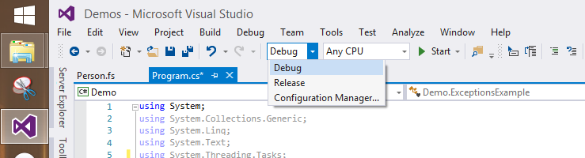
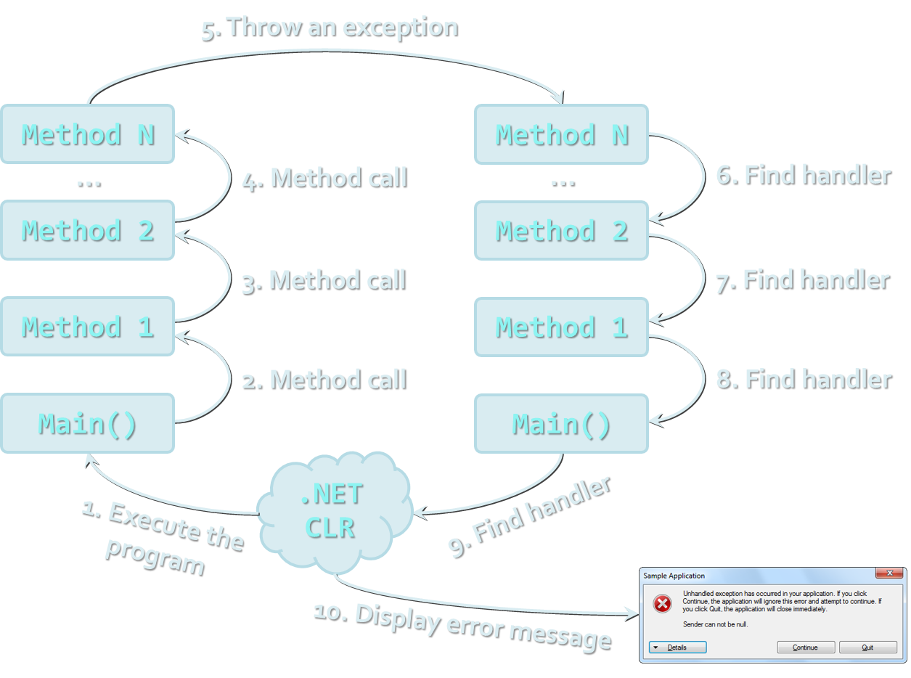

<!-- section start -->
<!-- attr: {  class:'slide-title', showInPresentation:true, hasScriptWrapper:true } -->
# Exception Handling
## Handling Errors during the Program Execution
<!--  -->
<!--  -->

<div class="signature">
	<p class="signature-course">C# Advanced</p>
	<p class="signature-initiative">Telerik Software Academy</p>
	<a href="https://telerikacademy.com" class="signature-link">https://telerikacademy.com</a>
</div>


<!-- section start -->

<!-- attr: { showInPresentation:true, hasScriptWrapper:true } -->
# Table of Contents
- [What are Exceptions?](#what-are-exceptions)
- [Handling Exceptions](#handling-exceptions)
- [The System.Exception Class](#system-exception-class)
- [Exception types and hierarchy](#exception-types)
- [Raising (Throwing) Exceptions](#throwing-exceptions)
- [Best Practices](#best-practices)

<!--  -->


<!-- section start -->
<!-- attr: { id:'what-are-exceptions', class:'slide-section', showInPresentation:true, hasScriptWrapper:true } -->
<!-- # <a id="what-are-exceptions"></a> What are Exceptions? -->
<!-- ## The Paradigm of Exceptions in OOP -->


<!-- attr: { showInPresentation:true, hasScriptWrapper:true, style:'font-size: 0.9em' } -->
# What are Exceptions?
- The `exceptions` in .NET Framework are classic implementation of the OOP exception model
- Deliver **powerful mechanism for centralized handling of errors** and unusual events
- Substitute procedure-oriented approach, in which each function returns error code
- **Simplify code construction and maintenance**
- **Allow the problematic situations to be processed at multiple levels**
- [Read more](https://en.wikipedia.org/wiki/Exception_handling) about exception handling in general on wikipedia

<!-- section start -->

<!-- attr: { id:'handling-exceptions', class:'slide-section', showInPresentation:true, hasScriptWrapper:true } -->
<!-- # <a id=""></a> Handling Exceptions -->

<!--  -->


<!-- attr: { showInPresentation:true, hasScriptWrapper:true } -->
# Handling Exceptions
- In C# the exceptions can be handled by the `try-catch-finally` construction

```cs
try
{
    // Do some work that can raise an exception
}
catch (SomeException)
{
    // Handle the caught exception
}
```

- `catch` blocks can be used multiple times to process different exception types

<!--  -->


<!-- attr: { showInPresentation:true, hasScriptWrapper:true } -->
# Handling Exceptions – _Example_

```cs
static void Main()
{
  string s = Console.ReadLine();
  try
  {
    int.Parse(s);
    Console.WriteLine("Valid integer number {0}.", s);
  }
  catch (FormatException)
  {
    Console.WriteLine("Invalid integer number!");
  }
  catch (OverflowException)
  {
    Console.WriteLine("The number is too big for int!");
  }
}
```

<!--  -->


<!-- attr: {  class:'slide-section demo', showInPresentation:true, hasScriptWrapper:true } -->
<!-- # Handling Exceptions -->

<!--  -->


<!-- attr: { id:'system-exception-class',  showInPresentation:true, hasScriptWrapper:true, style:'font-size: 0.9em' } -->
# <a id="system-exception-class"></a> The System.Exception Class
- **Exceptions in .NET are objects**
- The `System.Exception` class is base for all exceptions in CLR
  - **Contains information for the cause of the error** / unusual situation in the form of the following properties:
    - `Message` – text description of the exception
    - `StackTrace` – the snapshot of the stack at the moment of exception throwing
    - `InnerException` – exception that caused the current exception (if any)


<!-- attr: { showInPresentation:true, hasScriptWrapper:true, style:'font-size: 0.9em' } -->
# Exception Properties – _Example_

```cs
class ExceptionsExample
{
  public static void CauseFormatException()
  {
    string s = "an invalid number";
    int.Parse(s);
  }
 
  static void Main()
  {
    try
    {
      CauseFormatException();
    }
    catch (FormatException fe)
    {
      Console.Error.WriteLine("Exception: {0}\n{1}",
                                 fe.Message, fe.StackTrace);
    }
  }
}

```


<!-- attr: { showInPresentation:true, hasScriptWrapper:true, style:'font-size: 0.8em' } -->
# Exceptions Properties
- The `Message` property gives brief description of the problem
- The `StackTrace` property is extremely useful when identifying the reason caused the exception

```
Exception caught: Input string was not in a correct format.
   at System.Number.Parseint(String s, NumberStyles style, NumberFormatInfo info)
   at System.int.Parse(String s)
   at ExceptionsTest.CauseFormatException() in c:\consoleapplication1\exceptionstest.cs:line 8
   at ExceptionsTest.Main(String[] args) in c:\consoleapplication1\exceptionstest.cs:line 15
```


<!-- attr: { showInPresentation:true, hasScriptWrapper:true, style:'font-size: 0.9em' } -->
<!-- # Exception Properties -->
- File names and line numbers are accessible **only** if the compilation was in `Debug` mode
- When compiled in `Release` mode, the information in the property `StackTrace` is quite different:

```cs
Exception caught: Input string was not in a correct format.
   at System.Number.Parseint(String s, NumberStyles style, NumberFormatInfo info)
   at ExceptionsTest.Main(String[] args)
```

<!--  -->


<!-- attr: { class:'slide-section demo', showInPresentation:true, hasScriptWrapper:true } -->
<!-- # Exceptions Properties
## [Demo](https://github.com/TelerikAcademy/CSharp-Part-2/tree/master/Topics/07.%20Exception%20Handling/demos/ExceptionsProperties) -->


<!-- section start -->
<!-- attr: { class:'slide-section', showInPresentation:true, hasScriptWrapper:true } -->
<!-- # The Hierarchy of Exceptions -->

<!--  -->


<!-- attr: {  showInPresentation:true, hasScriptWrapper:true } -->
# Exceptions Hierarchy
- Exceptions in .NET Framework are organized in a hierarchy


<!-- attr: { id:'exception-types',  showInPresentation:true, hasScriptWrapper:true } -->
# <a id="exception-types"></a> Types of Exceptions
- .NET exceptions inherit from `System.Exception`
- The system exceptions inherit from `System.SystemException`, e.g.
  - `System.ArgumentException`
  - `System.NullReferenceException`
  - `System.OutOfMemoryException`
  - `System.StackOverflowException`
- User-defined exceptions should inherit from `System.Exception` ([more info](http://stackoverflow.com/questions/9037907/applicationexception-base-class-missing/9037944#9037944))


<!-- attr: {  showInPresentation:true, hasScriptWrapper:true, style:'font-size: 40px;' } -->
# Handling Exceptions
- When catching an exception of a particular class, all its inheritors (child exceptions) are caught too
- _Example_:

```cs
try
{
  // Do some works that can cause an exception
}
catch (System.ArithmeticException)
{
    // Handle the caught arithmetic exception
}
```

- Handles `ArithmeticException` and its descendants `DivideByZeroException` and `OverflowException`


<!--  -->


<!-- attr: { showInPresentation:true, hasScriptWrapper:true, style:'font-size: 40px;' } -->
# Find the Mistake!

```cs
static void Main()
{
   string s = Console.ReadLine();
   try
   {
      int.Parse(s);
   }
   catch (Exception) // this catch should come last
   {
      Console.WriteLine("Can not parse the number!");
   }
   catch (FormatException) // unreachable block
   {
      Console.WriteLine("Invalid integer number!");
   }
   catch (OverflowException) // unreachable block
   {
      Console.WriteLine("The number is too big to fit in int!");
   }
}
```


<!-- attr: {  showInPresentation:true, hasScriptWrapper:true } -->
# Handling All Exceptions
- All exceptions thrown by .NET managed code inherit the `System.Exception` exception
- Unmanaged code can throw other exceptions
- For handling all exceptions (even unmanaged) use the construction:

```cs
try
{
    // Do some works that can raise any exception
}
catch
{
    // Handle the caught exception
}
```

<!--  -->


<!-- section start -->
<!-- attr: { id:'throwing-exceptions', class:'slide-section', showInPresentation:true, hasScriptWrapper:true } -->
<!-- # <a id="throwing-exceptions"></a> Throwing Exceptions -->

<!--  -->


<!-- attr: { showInPresentation:true, hasScriptWrapper:true } -->
# Throwing Exceptions
- Exceptions are thrown (raised) by `throw` keyword in C#
  - Used to notify the calling code in case of error or unusual situation
- When an exception is thrown:
  - The program execution stops
  - The exception travels over the stack until a suitable `catch` block is reached to handle it
- Unhandled exceptions display error message


<!-- attr: { showInPresentation:true, hasScriptWrapper:true } -->
<!-- # How Exceptions Work? -->

<!--  -->


<!-- attr: { showInPresentation:true, hasScriptWrapper:true, style:'font-size: 0.9em' } -->
# Using throw Keyword
- Throwing an exception with an error message:

```cs
throw new ArgumentException("Invalid amount!");
```

- Exceptions can accept message and cause:
- _Note_: if the original exception is not passed the initial cause of the exception is lost

```cs
try
{
  int.Parse(str);
}
catch (FormatException fe)
{
  throw new ArgumentException("Invalid number", fe);
}
```


<!-- attr: { showInPresentation:true, hasScriptWrapper:true } -->
# Re-Throwing Exceptions
- Caught exceptions can be re-thrown again:

```cs
try
{
    int.Parse(str);
}
catch (FormatException fe)
{
    Console.WriteLine("Parse failed!");
    throw fe; // Re-throw the caught exception
}
```


```cs
catch (FormatException)
{
    throw; // Re-throws the last caught exception
}
```


<!-- attr: { showInPresentation:true, hasScriptWrapper:true, style:'font-size: 0.9em' } -->
# Throwing Exceptions – _Example_

```cs
public static double Sqrt(double value)
{
   if (value < 0)
       throw new System.ArgumentOutOfRangeException(
          "Sqrt for negative numbers is undefined!");
          
   return Math.Sqrt(value);
}
static void Main()
{
   try
   {
       Sqrt(-1);
   }
   catch (ArgumentOutOfRangeException ex)
   {
       Console.Error.WriteLine("Error: " + ex.Message);
       throw;
   }
}
```


<!-- attr: { class:'slide-section demo', showInPresentation:true, hasScriptWrapper:true } -->
<!-- # Throwing Exceptions
## [Demo](https://github.com/TelerikAcademy/CSharp-Part-2/tree/master/Topics/07.%20Exception%20Handling/demos/ThrowingExceptions) -->


<!-- attr: {  showInPresentation:true, hasScriptWrapper:true, style:'font-size: 40px;' } -->
# Choosing the Exception Type
- When an invalid parameter is passed to a method:
  - `ArgumentException`, `ArgumentNullException`, `ArgumentOutOfRangeException`
- When requested operation is not supported
  - `NotSupportedException`
- When a method is still not implemented
  - `NotImplementedException`
- If no suitable standard exception class is available
  - Create own exception class (inherit `System.Exception`)


<!-- section start -->
<!-- attr: { class:'slide-section', showInPresentation:true, hasScriptWrapper:true } -->
<!-- # Using Try-Finally Blocks -->
<!--  -->


<!-- attr: { showInPresentation:true, hasScriptWrapper:true, style:'font-size: 0.95em' } -->
# The try-finally Statement
- The statement:

```cs
try
{
    // Do some work that can cause an exception
}
finally
{
    // This block will always execute
}
```

- Ensures execution of given block in all cases
  - When exception is raised or not in the `try` block
- Used for execution of cleaning-up code, e.g. releasing resources


<!-- attr: { showInPresentation:true, hasScriptWrapper:true, style:'font-size: 0.8em' } -->
# try-finally – _Example_

```cs
static void TestTryFinally()
{
  Console.WriteLine("Code executed before try-finally.");
  
  try
  {
    int.Parse(Console.ReadLine());
    Console.WriteLine("Parsing was successful.");
    return; // Exit from the current method
  }
  catch (FormatException)
  {
    Console.WriteLine("Parsing failed!");
  }
  finally
  {
    Console.WriteLine("This cleanup code is always executed.");
  }
  
  Console.WriteLine(
    "This code is after the try-finally block.");
}
```


<!-- attr: { class:'slide-section demo', showInPresentation:true, hasScriptWrapper:true } -->
<!-- # try-finally
## [Demo](https://github.com/TelerikAcademy/CSharp-Part-2/tree/master/Topics/07.%20Exception%20Handling/demos/TryFinally) -->

<!--  -->


<!-- section start -->
<!-- attr: { id:'best-practices', class:'slide-section', showInPresentation:true, hasScriptWrapper:true } -->
<!-- # <a id="best-practices"></a> Exceptions: Best Practices 
## Don't be a codemonkey! -->


<!-- attr: { showInPresentation:true, hasScriptWrapper:true } -->
# Exceptions – Best Practices
- `catch` blocks should begin with the exceptions **lowest in the hierarchy**
  - And **continue with the more general exceptions**
  - Otherwise a compilation error will occur
- Each `catch` block should handle only these exceptions which it expects
  - If a method is not competent to handle an exception, it should be left unhandled
  - Handling all exceptions disregarding their type is popular bad practice (anti-pattern)!


<!-- attr: { showInPresentation:true, hasScriptWrapper:true } -->
<!-- # Exceptions – Best Practices -->
- When raising an exception always pass to the constructor **good explanation message**
- When throwing an exception always pass a **good description of the problem**
  - `Exception message` should explain **what causes the problem and how to solve it**
  - **Good**: "Size should be integer in range [1…15]"
  - **Good**: "Invalid state. First call Initialize()"
  - Bad: "Unexpected error"
  - Bad: "Invalid argument"
  
<!--  -->
<!--  -->


<!-- attr: { showInPresentation:true, hasScriptWrapper:true } -->
<!-- # Exceptions – Best Practices -->
- **Exceptions can decrease the application performance**
  - Throw exceptions only in situations which are really `exceptional` and should be handled
  - Do not throw exceptions in the normal program control flow (e.g. for invalid user input)
- CLR could throw exceptions at any time with no way to predict them
  - E.g. `System.OutOfMemoryException`


<!-- attr: { showInPresentation:true, hasScriptWrapper:true } -->
# Summary
- Exceptions provide flexible error handling mechanism in .NET Framework
  - Allow errors to be handled at multiple levels
  - Each exception handler processes only errors of particular type (and its child types)
    - Other types of errors are processed by some other handlers later
  - Unhandled exceptions cause error messages
- Try-finally ensures given code block is always executed (even when an exception is thrown)


<!-- section start -->
<!-- attr: { class:'slide-section', showInPresentation:true, hasScriptWrapper:true } -->
<!-- # Exception Handling
## Questions? -->


<!-- attr: { showInPresentation:true, hasScriptWrapper:true } -->
# Free Trainings @ Telerik Academy
- C# Programming @ Telerik Academy
  - [CSharp Advanced course](http://academy.telerik.com/student-courses/programming/csharp-programming-part-2/about)
- Telerik Software Academy
  - [academy.telerik.com](http://academy.telerik.com)
- Telerik Academy @ Facebook
  - [facebook.com/TelerikAcademy](https://facebook.com/TelerikAcademy)
- Telerik Software Academy Forums
  - [forums.academy.telerik.com](https://telerikacademy.com/Forum/Home)
